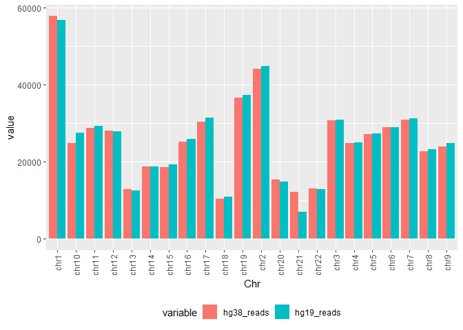
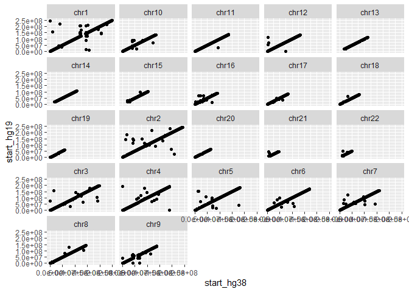
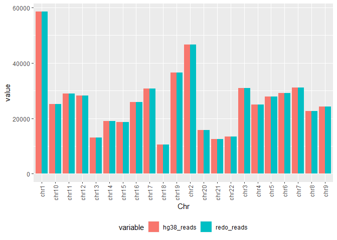
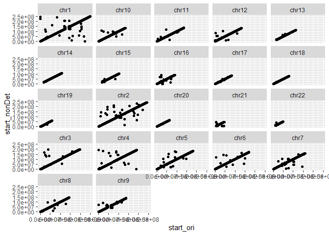

Assignment 4: Mappability continues
================

-   [Assignment Overview](#assignment-overview)
    -   [Important remarks](#important-remarks)
    -   [0. Getting ready](#getting-ready)
    -   [1. Differences between genome
        builds](#differences-between-genome-builds)
        -   [a. SE alignment against hg38 and
            hg19](#a.-se-alignment-against-hg38-and-hg19)
        -   [b. Making the files
            comparable](#b.-making-the-files-comparable)
        -   [c. Analyzing the
            differences](#c.-analyzing-the-differences)
        -   [d. Reads per chromosome](#d.-reads-per-chromosome)
        -   [d. Reads position in the genome
            builds](#d.-reads-position-in-the-genome-builds)
    -   [2. Ambiguity in reads mapping](#ambiguity-in-reads-mapping)
        -   [a. Redoing the hg38
            alignment](#a.-redoing-the-hg38-alignment)
        -   [b. Analyzing the ambiguity](#b.-analyzing-the-ambiguity)
        -   [c. Non-deterministic seeds](#c.-non-deterministic-seeds)
        -   [d. Analyzing the changes](#d.-analyzing-the-changes)

# Assignment Overview

The goal of this assignment is to get you acquainted with how the
different ways to analyze a file can change the results of the reads’
alignment against the reference genome. We will be using only one file:
**SRR12506919\_subset.fastq.gz**, that can be found under the following
path: **/usr/local/sahre/data/assignment\_4/**. It will be divided into
two parts:

Part 1: Analyzing different genome builds

Part 2: Ambiguity in reads mapping

## Important remarks

-   Remember to be as clear as possible with your answers.

-   Please make sure to explain your thought process behind your code
    and answers.

-   If you have used methods suggested on forums, websites, make sure to
    cite them.

-   If you have not been able to find the answer to a random bug with
    reasonable effort, please ask on Piazza! We are here to help, the
    assignments should be a safe environment for you to try new things
    and learn.

-   From now on, you will need to specify the output of your Rmarkdown
    as a github document using: **“output:github\_document”** instead of
    the *output:html\_document* default. This will create a folder
    within your working directory with all the plots created throughout
    your script, which will be used to create an **.md** extension file.
    Both the directory with the figures and the .md file will be
    required for you to be evaluated. Make sure to have them on your
    private repo. To do this, you need to:

    1.  Make sure you have cloned your assignments repository to your
        local computer

    2.  Download the Rmd of the assignment and add it to your repository
        on your local computer

    3.  Edit the assignment to fill in the answers and add your R code

    4.  Once you are done, knit your file. Double check that at the top
        of the Rmd under output, it has github\_document

    5.  Using your favorite github manager (like Github Desktop), commit
        your changes to your repository.

    6.  Pull to be up-to-date with any changes to your private
        repository.

    7.  Push the commit you made on step 6 to your repository.

    8.  Check that on your repository online you can see an *.md*
        extension file and a folder that includes the plots you created
        for the assignment, and that the plots are visible when viewing
        the .md file on GitHub.

## 0. Getting ready

As always, before we get started we will install the tools required for
the assignment. This time, we only need to add:

-   LiftOver (<https://genome.sph.umich.edu/wiki/LiftOver>). These is a
    package designed to change files from a specific coordinates system
    (i.e., genome build) to another.

-   bedtools (<https://bedtools.readthedocs.io/en/latest/>). It’s a
    powerful tool to compare genomic positions.

``` bash
#First, set up server, log into conda environment, and create a directory for this assignment:
ssh bkirsh@137.82.55.186
conda activate test_env
mkdir assignment4
cd assignment4

#?# Add liftOver to your conda environment created on A1, type the command you used below - 1 pt

conda install -c bioconda ucsc-liftover

#?# Add bedtools to your conda environment created on A1, type the command you used below - 1 pt

conda install -c bioconda bedtools
```

## 1. Differences between genome builds

Your Professor informs you that the Information and Technology (IT)
department was able to recover part of your data from the server.
Unfortunately, they were not able to recover your pipelines or scripts.
Since you were using a pre-made index of the reference genome, you don’t
remember which genome build was used to map your sequences (hg19 or
hg38). You cannot decide if it would be a big deal to use different
genome builds for different alignments, at the end you could just make
sure they are in the same genome build when you compare them, right?
Thus, you decide to investigate if it would make a lot of difference to
use a different version to assess what varies when you align the same
reads to different genome-builds.

### a. SE alignment against hg38 and hg19

``` bash
## Pre-made indexes can be found here: 
## hg19 index: /usr/local/share/indexes/hg19_bowtie2_index
## hg38 index: /usr/local/share/indexes/hg38_bowtie2_index
## Recall that this is the fastq to be used throughput: /usr/local/sahre/data/assignment_4/SRR12506919_subset.fastq.gz

#?# Perform a single-end alignment using bowtie2 against the pre-made index of the hg38 genome build - 2 pt

bowtie2 -x /usr/local/share/indexes/hg38_bowtie2_index -U /usr/local/share/data/assignment_4/SRR12506919_subset.fastq.gz -S bowtie2_hg38_output.sam

#?# Perform a single-end alignment using bowtie2 against the pre-made index of the hg19 genome build - 2 pt

bowtie2 -x /usr/local/share/indexes/hg19_bowtie2_index -U /usr/local/share/data/assignment_4/SRR12506919_subset.fastq.gz -S bowtie2_hg19_output.sam
```

### b. Making the files comparable

Before you can start comparing the files, you realize you need to
translate them to the same genomic coordinate system. If you don’t do
this and try to find mismatches between the files you will find a ton,
but that wouldn’t mean that the reads are mapping to different parts of
the genome, just that the coordinates are different (e.g. if there is a
1 bp insertion in hg38 relative to hg19, every base after that insertion
will have different coordinates). Hence, you go ahead and use your
favorite genome build: hg38. To translate hg19 to hg38, we need to do a
couple of steps:

-   Sam to Bam: Convert the alignemnt file (sam) to binary format (bam),
    this will facilitate the manipulaiton of the files and will decrease
    the disk space used substantially.

-   Bam to bed: Convert the bam alignment file to bed format, enabling
    the comparison of the genomic posisions where the reads mapped.

-   Change genomic coordinates: Use liftOver to change the alignment
    file made using the hg19 index to the hg38 coordinates of the
    genome.

``` bash
## Sam to Bam -------------
#?# Convert the SE alignment performed against hg19  (hg19 alignment) to bam, type the command you used below -1 pt

samtools view -h -b -o bowtie2_hg19_output.bam bowtie2_hg19_output.sam

#?# Convert the SE alignment performed against hg38 (hg38 alignment) to bam, type the command you used below -1 pt

samtools view -h -b -o bowtie2_hg38_output.bam bowtie2_hg38_output.sam

# NOTE: At this point, we can delete the .sam files, as they are quite large.

rm bowtie2_hg19_output.sam bowtie2_hg38_output.sam

## Bam to bed -------------
## Tip: Look into the bedtools bamtobed command
bedtools bamtobed --help
#?# Use bedtools to convert the hg19 alignment bam file to bed format, type the command you used below - 1 pt 

bedtools bamtobed -i bowtie2_hg19_output.bam > bowtie2_hg19_output.bed

#?# Use bedtools to convert the hg38 alignment bam file to bed format, type the command you used below - 1 pt 

bedtools bamtobed -i bowtie2_hg38_output.bam > bowtie2_hg38_output.bed

## LiftOver --------------
#?# Use liftOver to change the hg19 alignment bed file to the hg38 coordinate system, type the command/s you used below - 2 pt
## To do this, you will need the "chain file": /usr/local/share/data/assignment_4/hg19ToHg38.over.chain.gz
## Tip: Look at the liftOver documentation! 

liftOver bowtie2_hg19_output.bed /usr/local/share/data/assignment_4/hg19ToHg38.over.chain.gz liftOver_hg19to38_output.bed unMapped

# NOTE: At this point, we can delete the unMapped file, as it is not interesting to us for the purposes of this assignment.

rm unMapped
```

### c. Analyzing the differences

Now that both alignments are on the same coordinate system, they are
comparable and ready to be analyzed. What you really want to see how
individual reads mapped against the two genome builds. Did they map to
the same place or different places? To answer this, you need to sort
your bed files by read name so that you can identify which bed entries
in each file correspond to the same original read.

``` bash
#?# Using bash commands to sort the transformed hg19 alignment file bed alignment file by read name (column 4), type the command you used below - 2 pt
## Tip: Look at the sort command!

# ANSWER: Note that this command does not actually change the input file in place, so the sorted outputs are saved to new files.

sort -k 4 liftOver_hg19to38_output.bed > sorted_hg19to38.bed

#?# Using bash commands, sort the hg38 bed alignment file by read name (column 4), type the command you used below - 2 pt
## Tip: Look at the sort command!

sort -k 4 bowtie2_hg38_output.bed > sorted_hg38.bed
```

You were really happy to see a visual representation of your data the
last time you talked to your advisor about mapping parameters. You
decide to give it a try this time with your merged bed file to answer
your two main questions:

-   How many reads are there per chromosome and does this differ between
    genome builds?

-   Do the reads mapped to the same genome region?

### d. Reads per chromosome

Before you get started, you discover that a labmate of yours was
comparing the number of reads per chromosome under different conditions
and they created a function to make this process more robust (function
is below). You are really happy that this seems like the perfect
function to plot the diferent number of reads per chromosome in the
different genome builds, but there is one problem. The bed files need to
be merged into one, before you can use the function. Plus, you realize
that the function is very poorly documented and your labmate is AWOL due
to midterms, so there is no way he can explain you how the function
works. Your Professor asks you to go through the function and document
as much as possible the function so future people can use it too (also
because she wants to make sure you know what you are doing).

``` bash

## Merging the files: ---------------
#?# Using the join command on bash, merge the two bed files, so they follow the following format: 
## read_id  chr_hg38  start_hg38  end_hg38  strand_hg38 chr_hg19  start_hg19  end_hg19  strand_hg19 

#?# Type the command you used to merge the files below - 2pt
# ANSWER: Note that this command does not actually create a joint file from the input files, so the merged output is saved to a new file.

join -j 4 -o 1.4,1.1,1.2,1.3,1.6,2.1,2.2,2.3,2.6 sorted_hg38.bed sorted_hg19to38.bed > merged_hg38.bed

#?# Use the head command to view the first 3 rows of your merged file, copy the output below: - 2pt 

head -n 3 merged_hg38.bed

# ANSWER: The output is:
#SRR12506919.1 chr16 1379150 1379301 + chr16 1379150 1379301 +
#SRR12506919.10 chr1 109467028 109467179 + chr1 109467028 109467179 +
#SRR12506919.100 chr19 3556952 3557103 + chr19 3556952 3557103 +

## Copy the merged bed file to your local computer for analysis
scp bkirsh@137.82.55.186:/home/bkirsh/assignment4/merged_hg38.bed /mnt/c/Users/bkirs/Documents
```

Now that you have the files in the right order, you move your files to
your local computer to work on your personal RStudio!

``` r
#?# Go through the function line by line using your merged bed file and your chosen parameters, as if it weren't a function (e.g. set "merged_bed" to the data.frame containing your data, and run each line of the function (you will also need to set the parameters)). Explain in a concise way (using comments) how each line is changing the data. Use functions like head and tail to visualize the data as it's changing. - 4 pt

## reads.per.chr:
# This function takes a merged bed file of two conditions A and B and gives a data.frame of 3 columns: Chr, variable (condition), value (how many reads per chromosome are when using that condition)

## Parameters: 
# merged_bed: refers to the bed file you created on the previous section
# cols2compare=c(2,6): default is column 2 versus 6, which if you followed the format specified when you merged the files, they should correspond to the chromosome column of each read for the two conditions (e.g., hg38 and hg19)
# type.a=c("hg38", "redo"): you should specify a string, that states what is condition A. Defaults are "hg38" and "redo"
# type.b=c("hg19", "noDet"): you should specify a string, that states what is condition B. Defaults are "hg19" and "noDet"

reads.per.chr <- function(merged_bed, cols2compare=c(2,6), type.a=c("hg38", "redo"), type.b=c("hg19", "noDet")){
  
  canonical_chromosomes <- paste0("chr", 1:22) #this line creates a character vector comprised of UCSC-style chromosome names (i.e. "chrN")
  # it contains chromosomes 1 through 22, but excludes chrX, chrY, chrM, and unplaced or unlocalized sequences. 
  
  chr_subset <- merged_bed[,c(cols2compare[1])] #this line creates a character vector comprised of the chromosome column of each read for the hg38 condition (i.e. column 2), including non-canonical chromosomes
  # note: this type of data structure allows duplicate elements
  table_chrs1 <- table(chr_subset) #this line creates a contingency table that reports the frequency of each variable for the specified condition, in this case the hg38 chromosome column (i.e. column 2)

  chr_subset <- merged_bed[,c(cols2compare[2])] #this line creates a character vector comprised of the chromosome column of each read for the hg19 condition (i.e. column 6), including non-canonical chromosomes
  table_chrs2 <- table(chr_subset) #this line creates a contingency table that reports the frequency of each variable for the specified condition, in this case the hg19 chromosome column (i.e. column 6)
  
  compare.df <- data.frame(column1=table_chrs1[names(table_chrs1) %in% canonical_chromosomes],
                           column2=table_chrs2[names(table_chrs2) %in% canonical_chromosomes]) #this line creates a data frame to compare the frequency of each variable between the two conditions
  # it contains four columns: variable_condition1, frequency_condition1, variable_condition2, and frequency_condition2 - in this case the variable corresponds to the chromosome name and the conditions are hg19 versus hg38
  # it only includes the chromosomes defined by "canonical_chromosomes"
  
  compare.df <- compare.df[,c(1,2,4)] #this line removes the "variable_condition2" column (i.e. column 3), since it is redundant with the "variable_condition1" column (i.e. column 1), but preserves the frequency columns for pairwise comparison between conditions
  colnames(compare.df) <- c("Chr",paste0(type.a, "_reads"), paste0(type.b, "_reads")) #this lines renames the columns in the "compare.df" data frame to give it a more meaningful name that represents the conditions
  
  compare.df <- melt(compare.df) #this line stacks the frequency columns of each condition in "compare.df" into a single column of data, such that each row is a unique id-variable combination.
  # it converts wide-format data into long-format data, where individual rows of data are identified by the id variable "Chr"

    return(compare.df) #this line returns the final melted data frame
  
}
```

``` r
#?# Copy the files from the server to your local computer - 1pt

# ANSWER: From my local bash terminal on a new terminal window, I ran the command below.
#scp bkirsh@137.82.55.186:/home/bkirsh/assignment4/merged_hg38.bed /mnt/c/Users/bkirs/Documents

#?# Load your merged bed file into R suing the *read.csv* function and save it into a data.frame
#?# Type the command you used below  - 1pt

merged_bed.df <- read.csv("C:/Users/bkirs/Documents/merged_hg38.bed",header = FALSE, sep="",stringsAsFactors=FALSE, quote="") #read.csv() will always return a data frame

## Change the column names of your merged bed data.frame to: 
# read_id  chr_hg38  start_hg38  end_hg38  strand_hg38 chr_hg19  start_hg19  end_hg19  strand_hg19 
#?# Type the command you used below:

colnames(merged_bed.df) <- c('read_id','chr_hg38','start_hg38','end_hg38','strand_hg38','chr_hg19','start_hg19','end_hg19','strand_hg19') 

## Load the reshape2 library, install it if you don't already have it! 
## Tip: Use the "packages" tab on the left bottom screen 

#install.packages("reshape2")
library(reshape2)

#?# Run the reads.per.chr on your genome builds merged bed (previously loaded), specify all the parameters following the instructions of the function, type the command used below: - 1.5 pt 

output.df <- reads.per.chr(merged_bed.df,cols2compare=c(2,6),type.a="hg38",type.b="hg19")
```

    ## Using Chr as id variables

``` r
#?# How many reads were mapped to two different chromosomes? What percent of reads is this? Type the code and the answers for each below. 2 pt

library(dplyr)
```

    ## 
    ## Attaching package: 'dplyr'

    ## The following objects are masked from 'package:stats':
    ## 
    ##     filter, lag

    ## The following objects are masked from 'package:base':
    ## 
    ##     intersect, setdiff, setequal, union

``` r
canonical_chromosomes <- paste0("chr", 1:22)
canonical_merged_bed.df <- merged_bed.df %>% filter(chr_hg38 %in% canonical_chromosomes & chr_hg19 %in% canonical_chromosomes) # Filter the original merged data frame to contain only the chromosomes defined in "canonical_chromosomes"
differences.df <- mutate(canonical_merged_bed.df,chr_diff=ifelse(chr_hg19==chr_hg38,0,1)) # Create a data frame with all the original columns, plus a new column to represent mapping to the same chromosome (0) or to two different chromosomes (1)

table_diff <- table(differences.df$chr_diff) # Create a table to tabulate results and quantify the differences in mapping

View(table_diff)
prop.table(table_diff)
```

    ## 
    ##          0          1 
    ## 0.98419176 0.01580824

``` r
# ANSWER: We can inspect the table by calling "View(table_diff)" to find out that there were 8847 reads that mapped to two different chromosomes. Using "prop.table(table_diff)," we learn that this corresponds to 1.58% of reads.

## Using the output data.frame you got from running the reads.per.chr function on your merged bed, create a barplot that: 
## Uses the Chr column for the x-axis
## Useds the value (number of reads) column for the y-axis
## Uses the variable (conditions, also known as different genome builds in this case) column to "fill in" the color 
## Each build should have their own bar (next to each other), they shouldn't be stacked!!
#?# Type the command you used below: - 1.5 pt

library(ggplot2)
p <- ggplot(output.df, aes(x=Chr, y=value, fill=variable)) + geom_bar(stat="identity", position="dodge")
p + theme(legend.position="bottom", axis.text.x = element_text(angle = 90, vjust = 0.5, hjust=1))
```

<!-- -->

Which chromosome has the biggest difference between reads? Which genome
build had more reads for this chromosome? Answer below - 1 pt

ANSWER: Chromosome 21 has the biggest difference between reads. The hg38
build has more reads than the hg19 build for this chromosome.

### d. Reads position in the genome builds

``` r
## Using the start position of the reads on both genome builds, create a scatterplot using ggplot2 that: 
## Has the start in the hg38 genome build in the x-axis
## Has the start in the hg19 genome build in the y-axis
## Plots each chromosome in its own subplot (panel) (e.g. see facet_wrap())
## Plots only cases where both reads mapped to the same chromosome
#?# Type the command you used below: - 3 pt

library(ggplot2)
same_chr.df <- differences.df %>% filter((chr_diff == 0)) # Filter data frame to contain only the cases where both reads are mapped to the same chromosome
ggplot(same_chr.df, aes(x=start_hg38, y=start_hg19)) + geom_point() + facet_wrap(~chr_hg38) # The facet wrap could have been done using either "chr_hg38" or "chr_hg19" because only cases where the reads mapped to the same chromosome are being considered
```

<!-- -->

## 2. Ambiguity in reads mapping

You are glad that you have answered most of your burning questions about
read mapping and identified some of the things that can go wrong. So,
you decide to share your knowledge with your friend. They tell you that
they ran the SE alignment following your instructions and were about to
share their results, only to find that when repeating the alignment for
the same file their results changed! They come to you to help them with
your wisdom. Your vast experience leads you to believe that something
must have happened when the alignment was performed.

### a. Redoing the hg38 alignment

``` bash
#?# Re-run the SE alignment that you performed on 1a against the hg38 genome build, use exactly the same parameters, just change the output name  - 0.5 pt

bowtie2 -x /usr/local/share/indexes/hg38_bowtie2_index -U /usr/local/share/data/assignment_4/SRR12506919_subset.fastq.gz -S bowtie2_hg38_output_redo.sam

## Change both sam output to bam. Remember to remove the sam files right after it's done!
#?# Type the commands you used to convert the file below  - 0.5 pt

samtools view -h -b -o bowtie2_hg38_output_redo.bam bowtie2_hg38_output_redo.sam

rm bowtie2_hg38_output_redo.sam

#?# Change the bam file to bed, using the betdools bedtobam function, type the command you used for the file below - 0.5 pt

bedtools bamtobed -i bowtie2_hg38_output_redo.bam > bowtie2_hg38_output_redo.bed

#?# Sort the file by read name (same as you did on part 1, using column 4), type the command you used below - 1 pt

sort -k 4 bowtie2_hg38_output_redo.bed > sorted_hg38_redo.bed

## Because what you really want to see is if and what changed between these bowtie2 runs compared to your first run on Part 1b, you decide to merge each new run file with the original:

#?# Merge the "redo" bed file and the "original" hg38 alignment bed (from part 1c) using the join command, as in part 1c, this time follow this format: 1 pt
## read_id chr_ori  start_ori  end_ori  strand_ori chr_redo  start_redo  end_redo  strand_redo
## NOTE: Remember to save the output!

join -j 4 -o 1.4,1.1,1.2,1.3,1.6,2.1,2.2,2.3,2.6 sorted_hg38.bed sorted_hg38_redo.bed > merged_hg38_redo.bed

#?# Use the head command to view the first 3 rows of your merged file, copy the output below: - 2pt 

head -n 3 merged_hg38_redo.bed

#SRR12506919.1 chr16 1379150 1379301 + chr16 1379150 1379301 +
#SRR12506919.10 chr1 109467028 109467179 + chr1 109467028 109467179 +
#SRR12506919.100 chr19 3556952 3557103 + chr19 3556952 3557103 +

## Copy the merged bed file to your local computer for analysis

scp bkirsh@137.82.55.186:/home/bkirsh/assignment4/merged_hg38_redo.bed /mnt/c/Users/bkirs/Documents
```

### b. Analyzing the ambiguity

Your last analysis on the differences between genome build turn out so
well, that you want to do the same. You have prepared the files so they
are in the same format as needed to run your labmate’s
*reads.per.chromosome* function, and are ready to see the graph.

``` r
#?# Load your merged bed file into R using the *read.csv* function and save it into a data.frame
#?# Type the command you used below  - 1pt

merged_redo_bed.df <- read.csv("C:/Users/bkirs/Documents/merged_hg38_redo.bed",header = FALSE, sep="",stringsAsFactors=FALSE, quote="") #read.csv() will always return a data frame

## Change the column names of your merged bed data.frame to: 
## read_id chr_ori  start_ori  end_ori  strand_ori chr_redo  start_redo  end_redo  strand_redo
#?# Type the command you used below:

colnames(merged_redo_bed.df) <- c('read_id','chr_ori','start_ori','end_ori','strand_ori','chr_redo','start_redo','end_redo','strand_redo')

#?# Run the reads.per.chr on your genome builds merged bed (previously loaded), specify all the parameters following the instructions of the function, type the command used below: - 1.5 pt 

library(reshape2)
output_redo.df <- reads.per.chr(merged_redo_bed.df,cols2compare=c(2,6),type.a="hg38",type.b="hg19")
```

    ## Using Chr as id variables

``` r
#?# How many reads were mapped to two different chromosomes? What percent of reads is this? Type the code and the answers for each below. 2 pt

library(dplyr)
canonical_merged_redo_bed.df <- merged_redo_bed.df %>% filter(chr_ori %in% canonical_chromosomes & chr_redo %in% canonical_chromosomes) # Filter the original merged data frame to contain only the chromosomes defined in "canonical_chromosomes"
differences_redo.df <- mutate(canonical_merged_redo_bed.df,chr_diff=ifelse(chr_ori==chr_redo,0,1)) # Create a data frame with all the original columns, plus a new column to represent mapping to the same chromosome (0) or to two different chromosomes (1)

table_redo_diff <- table(differences_redo.df$chr_diff) # Create a table to tabulate results and quantify the differences in mapping

View(table_redo_diff)
prop.table(table_redo_diff)
```

    ## 
    ## 0 
    ## 1

``` r
# ANSWER: We can inspect the table by calling "View(table_redo_diff)" to find out that there were no reads that mapped to two different chromosomes. Using "prop.table(table_redo_diff)," we confirm that 100% of reads were mapped to the same chromosome (i.e. 0% of reads were mapped to two different chromosomes).

## Using the output data.frame you got from running the reads.per.chr function on your merged bed, do a barplot that: 
## Uses the Chr column for the x-axis
## Useds the value (number of reads) column for the y-axis
## Uses the variable (conditions, also known as different runs in this case) column to "fill in" the color 
## Each condition must have their own bar, they shouldn't be stacked!!

#?# Type the command you used below: - 1.5 pt

library(ggplot2)
p <- ggplot(output_redo.df, aes(x=Chr, y=value, fill=variable)) + geom_bar(stat="identity", position="dodge")
p + theme(legend.position="bottom", axis.text.x = element_text(angle = 90, vjust = 0.5, hjust=1))
```

<!-- -->

``` r
#?# Do you see differences among the number of reads per chromosome between the two runs? Answer yes or no - 0.5 pt

# ANSWER: No.
```

You are intrigued by the results of your graph and decide to go deeper
into the alignment to get a better idea of where the reads mapped within
the genome.

``` r
## Subtract the start position of the original bed from the start position of the redo for all the reads
#?# Type the command used below: - 0.5 pt

library(dplyr)
same_redo_chr.df <- differences_redo.df %>% filter((chr_diff == 0)) # Filter data frame to contain only the cases where both reads are mapped to the same chromosome
start_differences.df <- mutate(same_redo_chr.df,start_diff = (start_ori - start_redo))

## Use the *table* command to tabulate the results from the previous question. Ex. table(a-b)
#?# Type the command you used below: - 0.5 pt

table_redo_start_diff <- table(start_differences.df$start_diff)

#?# What do you see? How many have a non zero difference in position start? - 0.5 pt

View(table_redo_start_diff)
prop.table(table_redo_start_diff)
```

    ## 
    ## 0 
    ## 1

``` r
# ANSWER: There are no non-zero differences in position start. We can verify this by using the commands "nrow(merged_redo_bed)" or "prop.table(table_redo_start_diff)," both of which confirm that 100% of reads have a zero difference in position start.

#?# Describe how would you expect a scatterplot comparing the start ends in both runs would look like - 0.5 pt
## x-axis: original run
## y-axis: re-run

# ANSWER: We can expect to see a scatterplot that conists of a diagonal line with a positive slope. All the plotted data points will lie on that line, meaning that every point in the x-axis (i.e. original start coordinate) is an exact correspondance to every point in the y-axis (i.e. redo start coordinate).
```

### c. Non-deterministic seeds

You are confused by your friend’s results, you don’t seem to have the
same problem. You ask her for the command she used to run her alignment
and you notice a key difference. She included the following flags:
**–non-deterministic –seed 3** . You decide to explore what is this
command doing and if it would change your data.

``` bash
#?# Re-run the SE alignment that you performed on 1a against the hg38 genome build, change the output name and add this parameter:* --non-deterministic --seed 3 * - 1 pt

bowtie2 -x /usr/local/share/indexes/hg38_bowtie2_index -U /usr/local/share/data/assignment_4/SRR12506919_subset.fastq.gz -S bowtie2_hg38_output_nondet.sam --non-deterministic --seed 3

## Change both sam outputs to bam. Remember to remove the sam files right after it's done!
#?# Type the commands you used to convert the file below  - 0.5 pt

samtools view -h -b -o bowtie2_hg38_output_nondet.bam bowtie2_hg38_output_nondet.sam

rm bowtie2_hg38_output_nondet.sam

#?# Change the bam file to bed, using the betdools bedtobam function, type the command you used for the file below - 0.5 pt

bedtools bamtobed -i bowtie2_hg38_output_nondet.bam > bowtie2_hg38_output_nondet.bed

#?# Sort the file by read name (same as you did on part 1, using column 4), type the command you used below - 1 pt

sort -k 4 bowtie2_hg38_output_nondet.bed > sorted_hg38_nondet.bed


#?# Merge the "non deterministic" bed file and the "original" hg38 alignment bed (part 1c) using the join command, as in part 1c, this time follow this format: - 1 pt
## read_id  chr_ori  start_ori  end_ori  strand_ori chr_nonDet  start_nonDet  end_nonDet  strand_nonDet 
## NOTE: Remember to save the output!

join -j 4 -o 1.4,1.1,1.2,1.3,1.6,2.1,2.2,2.3,2.6 sorted_hg38.bed sorted_hg38_nondet.bed > merged_hg38_nondet.bed

#?# Use the head command to view the first 3 rows of your merged file, copy the output below: - 2pt 

head -n 3 merged_hg38_nondet.bed

#SRR12506919.1 chr16 1379150 1379301 + chr16 1379150 1379301 +
#SRR12506919.10 chr1 109467028 109467179 + chr1 109467028 109467179 +
#SRR12506919.100 chr19 3556952 3557103 + chr19 3556952 3557103 +

## Copy the merged bed file to your local computer for analysis

scp bkirsh@137.82.55.186:/home/bkirsh/assignment4/merged_hg38_nondet.bed /mnt/c/Users/bkirs/Documents
```

### d. Analyzing the changes

``` r
#?# Load your merged bed file onto R using the *read.csv* function and save it into a data.frame
#?# Type the command you used below  - 1 pt

merged_nondet_bed.df <- read.csv("C:/Users/bkirs/Documents/merged_hg38_nondet.bed",header = FALSE, sep="",stringsAsFactors=FALSE, quote="") #read.csv() will always return a data frame

## Change the column names of your merged bed data.frame to: 
## read_id  chr_ori  start_ori  end_ori  strand_ori chr_nonDet  start_nonDet  end_nonDet  strand_nonDet 
#?# Type the command you used below:

colnames(merged_nondet_bed.df) <- c('read_id','chr_ori','start_ori','end_ori','strand_ori','chr_nonDet','start_nonDet','end_nonDet','strand_nonDet')

#?# How many reads were mapped to two different chromosomes? What percent of reads is this? Type the code and the answers for each below. 2 pt

library(dplyr)
canonical_merged_nondet_bed.df <- merged_nondet_bed.df %>% filter(chr_ori %in% canonical_chromosomes & chr_nonDet %in% canonical_chromosomes) # Filter the original merged data frame to contain only the chromosomes defined in "canonical_chromosomes"
differences_nondet.df <- mutate(canonical_merged_nondet_bed.df,chr_diff=ifelse(chr_ori==chr_nonDet,0,1)) # Create a data frame with all the original columns, plus a new column to represent mapping to the same chromosome (0) or to two different chromosomes (1)

table_nondet_diff <- table(differences_nondet.df$chr_diff) # Create a table to tabulate results and quantify the differences in mapping

View(table_nondet_diff)
prop.table(table_nondet_diff)
```

    ## 
    ##           0           1 
    ## 0.990222194 0.009777806

``` r
# ANSWER: We can inspect the table by calling "View(table_nondet_diff)" to find out that there were 5517 reads that mapped to two different chromosomes. Using "prop.table(table_nondet_diff)," we learn that this corresponds to 0.98% of reads.

## Using the start position of the reads on both alignment runs do a scatterplot in ggplot that: 
## Has the start in the hg38 genome build in the x-axis
## Has the start in the hg19 genome build in the y-axis
## Plots each chromosome in its own subplot (panel) (e.g. see facet_wrap())
## Plots only cases where both reads mapped to the same chromosome
#?# Type the command you used below: - 2 pt

library(ggplot2)
same_nondet_chr.df <- differences_nondet.df %>% filter((chr_diff == 0)) # Filter data frame to contain only the cases where both reads are mapped to the same chromosome
ggplot(same_nondet_chr.df, aes(x=start_ori, y=start_nonDet)) + geom_point() + facet_wrap(~chr_ori) # The facet wrap could have been done using either "chr_ori" or "chr_nonDet" because only cases where the reads mapped to the same chromosome are being considered
```

<!-- -->

``` r
#?# Explain why this changes when you add the --non-deterministic --seed 3 flags. What is are these flags doing? Why did you get the result you saw in 2b?- 2 pt
## Tip: Look at the bowtie2 documentation!

# ANSWER: In Bowtie 2, when a set of equally-good alignment choices are found, a pseudo-random number is used to decide which to report. The "--non-deterministic" option changes the way that this pseudo-random generator works.  Normally, Bowtie 2 will report the same alignment for identical reads (same read name, nucleotide string, and quality string), even if there are many different equally good alignments. This was true for 2b, where no flags were used and the same alignment was reported for identical reads, even if there was ambiguity. However, by adding the "--non-deterministic --seed 3" flags, Bowtie 2 did not necessarily report the same alignment for identical reads. As a result, we learn that, as opposed to 2b, there were reads mapped to two different chromosomes in this case.

#?# How do the number of off-diagonal reads and reads mapping to different chromosomes compare between where we mapped to two different genome versions (and then lifted over), versus the use of non-deterministic alignment? What fraction of reads that you found aligned to different chromsomes when using hg19 vs hg38 result from the differences between these two versions? - 3 pts

# ANSWER: Both the lifted over and the non-deterministic alignments had off-diagonal reads and reads mapping to different chromosomes. While there were more off-diagonal data points in the non-deterministic data set, the numeric value of reads that mapped to two different chromosomes was larger for the lifted over data set. From the non-deterministic alignment, we learned that 5517 mapped differently due to the arbitrary choice between equally-good alignments. Thus, there were 3330 reads (8847 - 5517), or 0.58% (3330 / 574865), that aligned to two different chromosomes because of actual differences between the hg19 and the hg38 genome builds.
```

Please knit your Rmd file to github\_document and include both in your
submission. Successful knitting to github\_document - 2 pts
