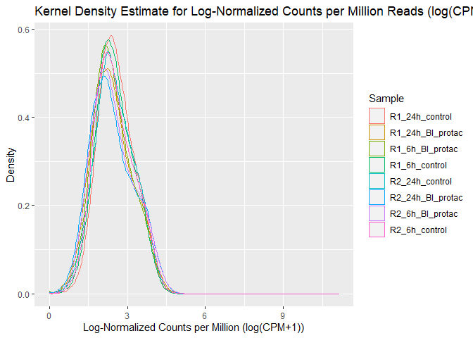
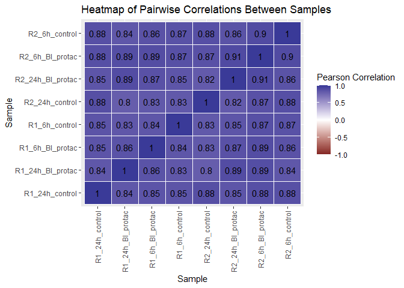
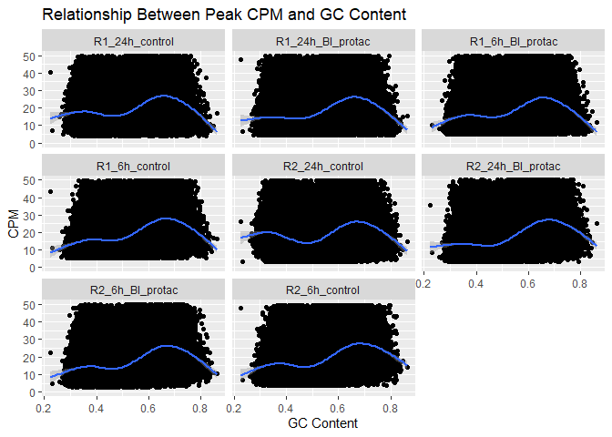
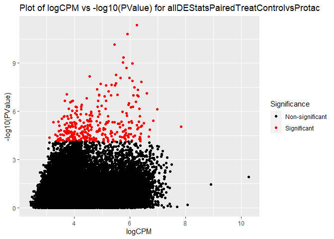

Genome Informatics A6
================
24/02/2021

-   [Part 1: understanding the
    experiment](#part-1-understanding-the-experiment)
    -   [`#?#` *Make the above plot. Each point should represent one of
        the samples. - 1
        pt*](#-make-the-above-plot-each-point-should-represent-one-of-the-samples---1-pt)
    -   [`#?#` *Can we compare BRM014 to DMSO across all time points?
        Why/why not? - 1
        pt*](#-can-we-compare-brm014-to-dmso-across-all-time-points-whywhy-not---1-pt)
-   [Part 2: QC](#part-2-qc)
    -   [`#?#` Make a plot with read coverage on the y-axis (total
        number of reads) and the samples on the x-axis. - 3
        pt\*](#-make-a-plot-with-read-coverage-on-the-y-axis-total-number-of-reads-and-the-samples-on-the-x-axis---3-pt)
    -   [`#?#` *Which sample has the most coverage? - 0.5
        pt*](#-which-sample-has-the-most-coverage---05-pt)
    -   [`#?#` *Which sample has the least? - 0.5
        pt*](#-which-sample-has-the-least---05-pt)
    -   [`#?#` *What is the % difference between the max and min
        (relative to the min)? - 0.5
        pt*](#-what-is-the--difference-between-the-max-and-min-relative-to-the-min---05-pt)
    -   [`#?#` *Create a new data.frame containing only the BI\_protac
        and control samples - 1
        pt*](#-create-a-new-dataframe-containing-only-the-bi_protac-and-control-samples---1-pt)
    -   [`#?#` *For this subset, calculate the counts per million reads
        (CPM) for each sample - 2
        pt*](#-for-this-subset-calculate-the-counts-per-million-reads-cpm-for-each-sample---2-pt)
    -   [`#?#` *Plot the kernel density estimate for CPM (x axis). 1
        curve per sample, different colours per curve. - 1
        pt*](#-plot-the-kernel-density-estimate-for-cpm-x-axis-1-curve-per-sample-different-colours-per-curve---1-pt)
    -   [`#?#` *Plot the kernel density estimate for log(CPM+1) (x
        axis), coloured as before - 1
        pt*](#-plot-the-kernel-density-estimate-for-logcpm1-x-axis-coloured-as-before---1-pt)
    -   [`#?#` *Why do you think log-transforming is usually performed
        when looking at genomics data? What about adding 1 before log
        transforming? - 2
        pt*](#-why-do-you-think-log-transforming-is-usually-performed-when-looking-at-genomics-data-what-about-adding-1-before-log-transforming---2-pt)
    -   [`#?#` *Some regions have very large CPMs. Inspect the peaks for
        which CPM&gt;400. What do you notice about them? 3
        pt*](#-some-regions-have-very-large-cpms-inspect-the-peaks-for-which-cpm400-what-do-you-notice-about-them-3-pt)
    -   [`#?#` *Calculate the pairwise correlations between log(CPM+1)s
        for the samples and plot them as a heatmap (samples x samples) -
        3
        pt*](#-calculate-the-pairwise-correlations-between-logcpm1s-for-the-samples-and-plot-them-as-a-heatmap-samples-x-samples---3-pt)
    -   [`#?#` *What do you expect the correlations between replicates
        to look like? Is that what you see? - 2
        pt*](#-what-do-you-expect-the-correlations-between-replicates-to-look-like-is-that-what-you-see---2-pt)
    -   [`#?#` *Filter your data, retaining only regions where the
        average counts per sample is greater than 10, and also remove
        mitochondrial regions - 3
        pt*](#-filter-your-data-retaining-only-regions-where-the-average-counts-per-sample-is-greater-than-10-and-also-remove-mitochondrial-regions---3-pt)
    -   [`#?#` *How many peaks did you have before? How many do you have
        now? - 1
        pt*](#-how-many-peaks-did-you-have-before-how-many-do-you-have-now---1-pt)
-   [Part 3: Differential ATAC](#part-3-differential-atac)
    -   [`#?#` *Make a count matrix called `countMatrix` for the
        BI\_protac and control samples, including only the peaks we
        retained above - 2
        pt*](#-make-a-count-matrix-called-countmatrix-for-the-bi_protac-and-control-samples-including-only-the-peaks-we-retained-above---2-pt)
    -   [`#?#` *Make an MA plot for allDEStatsPairedTreatControlvsProtac
        -2pt*](#-make-an-ma-plot-for-alldestatspairedtreatcontrolvsprotac--2pt)
    -   [`#?#` *Make an MA plot for allDEStatsPairedTime6vs24 - 1
        pt*](#-make-an-ma-plot-for-alldestatspairedtime6vs24---1-pt)
    -   [`#?#` *Perform the same differential peak analysis using loess
        regularization. - 1
        pt*](#-perform-the-same-differential-peak-analysis-using-loess-regularization---1-pt)
    -   [`#?#` *Make the same two MA plots as before, but this time
        using the loess normalized analysis - 1
        pt*](#-make-the-same-two-ma-plots-as-before-but-this-time-using-the-loess-normalized-analysis---1-pt)
    -   [`#?#` *What was the first normalization method? What changed in
        the MA plots? Which analysis do you think is more reliable and
        why? - 4
        pt*](#-what-was-the-first-normalization-method-what-changed-in-the-ma-plots-which-analysis-do-you-think-is-more-reliable-and-why---4-pt)
-   [Part 4: GC bias](#part-4-gc-bias)
    -   [`#?#` *Convert the region IDs to a GRanges object - 3
        pt*](#-convert-the-region-ids-to-a-granges-object---3-pt)
    -   [`#?#` *Extract the genomic DNA sequences for each peak using
        hg38 - 3
        pt*](#-extract-the-genomic-dna-sequences-for-each-peak-using-hg38---3-pt)
    -   [`#?#` *Create scatter plots (one per sample, e.g. using
        facet\_wrap), including lines of best fit (GAM), where each plot
        shows GC content (x axis) vs CPM (y axis) for each peak (points)
        -2pt*](#-create-scatter-plots-one-per-sample-eg-using-facet_wrap-including-lines-of-best-fit-gam-where-each-plot-shows-gc-content-x-axis-vs-cpm-y-axis-for-each-peak-points--2pt)
    -   [`#?#` *Repeat the above, but this time showing only the lines
        of best fit and all on the same plot - 2
        pt*](#-repeat-the-above-but-this-time-showing-only-the-lines-of-best-fit-and-all-on-the-same-plot---2-pt)
    -   [`#?#` *Given this result, predict whether we will see a
        significant relationship between GC content and logFC in our
        differential peak analysis (loess-normalized). Justify your
        prediction. Predicting “wrong” will not be penalized, as long as
        your justification is correct. Don’t retroactively change your
        answer. - 2
        pt*](#-given-this-result-predict-whether-we-will-see-a-significant-relationship-between-gc-content-and-logfc-in-our-differential-peak-analysis-loess-normalized-justify-your-prediction-predicting-wrong-will-not-be-penalized-as-long-as-your-justification-is-correct-dont-retroactively-change-your-answer---2-pt)
    -   [`#?#` *Plot the relationship between GC and logFC for the
        loess-normalized ControlvsProtac analysis. Also include a line
        of best fit (blue) and y=0 (red) - 2
        pt*](#-plot-the-relationship-between-gc-and-logfc-for-the-loess-normalized-controlvsprotac-analysis-also-include-a-line-of-best-fit-blue-and-y0-red---2-pt)
    -   [`#?#` *Now plot the same thing for the NON loess-normalized
        ControlvsProtac analysis. - 1
        pt*](#-now-plot-the-same-thing-for-the-non-loess-normalized-controlvsprotac-analysis---1-pt)
    -   [`#?#` *Was your prediction correct? Do you think we should also
        account for GC normalization in our differential ATAC analysis?
        Why/why not? - 3
        pt*](#-was-your-prediction-correct-do-you-think-we-should-also-account-for-gc-normalization-in-our-differential-atac-analysis-whywhy-not---3-pt)
-   [Part 5: Differential analysis
    results](#part-5-differential-analysis-results)
    -   [`#?#` *Suppose we perform the analyses above, redoing the
        differential analysis once more with GC normalization, and also
        considering that we tested loess and the default normalization
        methods. Did we P-hack? Why or why not? - 2
        pt*](#-suppose-we-perform-the-analyses-above-redoing-the-differential-analysis-once-more-with-gc-normalization-and-also-considering-that-we-tested-loess-and-the-default-normalization-methods-did-we-p-hack-why-or-why-not---2-pt)
    -   [`#?#` *Now considering the two comparisons (6 vs 24 hours, and
        protac vs control). EdgeR performed a correction for MHT, but if
        we want to analyze the results from both comparisons, do we need
        to re-adjust to account for the fact that we tested two
        different hypothesis sets (time and treatment)? Why/not? - 2
        pt*](#-now-considering-the-two-comparisons-6-vs-24-hours-and-protac-vs-control-edger-performed-a-correction-for-mht-but-if-we-want-to-analyze-the-results-from-both-comparisons-do-we-need-to-re-adjust-to-account-for-the-fact-that-we-tested-two-different-hypothesis-sets-time-and-treatment-whynot---2-pt)
    -   [`#?#` *How many differential peaks did you find
        (FDR&lt;0.01). - 1
        pt*](#-how-many-differential-peaks-did-you-find-fdr001---1-pt)
    -   [`#?#` *Make a volcano plot of the
        allDEStatsPairedTreatControlvsProtac, with -log10(p-value) on
        the y axis and logFC on the x. Colour points that are
        significant at an FDR&lt;0.01. - 2
        pt*](#-make-a-volcano-plot-of-the-alldestatspairedtreatcontrolvsprotac-with--log10p-value-on-the-y-axis-and-logfc-on-the-x-colour-points-that-are-significant-at-an-fdr001---2-pt)
    -   [`#?#` *Plot the logCPM (x axis) by -log10(Pvalue) (y axis),
        again colouring by FDR&lt;0.01. - 2
        pt*](#-plot-the-logcpm-x-axis-by--log10pvalue-y-axis-again-colouring-by-fdr001---2-pt)
    -   [`#?#` *Do you think our initial filtering on peaks with at
        least 10 reads on average per sample was a good choice? Why or
        why
        not?*](#-do-you-think-our-initial-filtering-on-peaks-with-at-least-10-reads-on-average-per-sample-was-a-good-choice-why-or-why-not)

``` r
#install any of these you might not have already
library(ggplot2)
library(edgeR)
```

    ## Loading required package: limma

``` r
library(reshape)
```

*Today we will be looking at a differential ATAC-seq dataset between
cells treated with an anti BAF protac and control (untreated) cells. The
cell type is HAP1, a cancer cell line with a near-haploid genome. We
will use this dataset to explore differential analysis. *

*The GEO entry is located here, where you can read more about the
experiments:
<https://www.ncbi.nlm.nih.gov/geo/query/acc.cgi?acc=GSE148175> *

*This is the paper: <https://www.nature.com/articles/s41588-021-00777-3>
*

*“Acute BAF perturbation causes immediate changes in chromatin
accessibility”*

``` r
#download the data
atacSeqData = read.table(textConnection(readLines(gzcon(url("ftp://ftp.ncbi.nlm.nih.gov/geo/series/GSE148nnn/GSE148175/suppl/GSE148175_count_matrix_raw_atac_BRM014_ACBI1.csv.gz")))), 
                      sep=",", stringsAsFactors = FALSE, header = TRUE)

#NOTE: Inspection of the data.
#glimpse(atacSeqData)
#This is a data.frame with 56,617 rows (coverage) and 25 columns (1 region; 24 samples)
```

``` r
#create a sample metadata data.frame
samples = data.frame(ID = names(atacSeqData)[2:ncol(atacSeqData)])
samples$replicate = gsub("(R[12])_([0-9]+[minh]+)_(.*)$","\\1",samples$ID)
samples$timeName = gsub("(R[12])_([0-9]+[minh]+)_(.*)$","\\2",samples$ID)
samples$treatment = gsub("(R[12])_([0-9]+[minh]+)_(.*)$","\\3",samples$ID)
samples$treatment[samples$treatment=="N"]="BRM014"
samples$time= as.numeric(gsub("[a-z]*","",samples$timeName))
samples$time[grepl("min",samples$timeName)]=samples$time[grepl("min",samples$timeName)]/60

#NOTE: Inspection of the data.
#glimpse(samples)
#This is a data.frame with 24 rows (samples) and 5 columns (ID, replicate, timeName, treatment, time)
```

# Part 1: understanding the experiment

*Now using `samples` make a plot showing the experimental design, with
time on the x axis, treatment on the y axis, and one plot on the left
and one on the right for the two replicates (e.g. using `facet_grid`).*

### `#?#` *Make the above plot. Each point should represent one of the samples. - 1 pt*

``` r
#here, if the point is there, it means such a sample exists, if absent it means that there is no such sample

p <- ggplot(samples, aes(x=time, y=treatment)) + geom_point() + labs(title= "Plot of Experimental Design", y = "Treatment", x = "Time (hours)")
p + facet_grid(cols = vars(replicate))
```

<!-- -->

*In this study, one of the things they were comparing was BRM014 to
DMSO. The drug BRM014 is dissolved in DMSO, so DMSO alone is the
appropriate control to gauge the effect of BRM014.*

### `#?#` *Can we compare BRM014 to DMSO across all time points? Why/why not? - 1 pt*

\#ANSWER: No. We can only compare BRM014 to DMSO at the time points 5min
and 24h, since there is no such DMSO sample at the remaining time points
(i.e., 10min, 30min, 1h, and 6h). Since DMSO is the control to gauge the
effect of BRM014 and is only present at the first and last time points,
a comparison between the two is only appropriate at those times.

``` r
#NOTE: We can further inspect the data.frame to verify this answer. These commands show that DMSO samples are only present at times 5min and 24h, while BRM014 is present at every time point (i.e., 5min, 10min, 30min, 1h, 6h, and 24h).

#samples[samples$treatment=="DMSO",]
#samples[samples$treatment=="BRM014",]
```

# Part 2: QC

*With most genomics data, it is important both that samples have
sufficient coverage, and that the samples have similar coverage. Either
case can lead to underpowered analysis, or misleading results. Calcualte
the read coverage for each sample. *

### `#?#` Make a plot with read coverage on the y-axis (total number of reads) and the samples on the x-axis. - 3 pt\*

``` r
# there are many ways you could do this; one of which is using the melt/cast functions from reshape

count_matrix <- atacSeqData[,2:ncol(atacSeqData)] #build a count matrix from the original data set by removing the "region" column
sum_matrix <- data.frame(t(colSums(count_matrix))) #sum the columns to calculate the total number of reads for every sample
melt_matrix <- melt(sum_matrix, id.vars=c()) #melt the matrix to facilitate plotting

q <- ggplot(data=melt_matrix, aes(x=variable, y=value)) + geom_bar(stat="identity") + theme(axis.text.x = element_text(angle = 90, vjust = 0.5, hjust=1)) + labs(title= "Plot of Read Coverage per Sample", y = "Total Number of Reads", x = "Sample")
q
```

<!-- -->

### `#?#` *Which sample has the most coverage? - 0.5 pt*

``` r
melt_matrix[which.max(melt_matrix$value),]
```

    ##      variable   value
    ## 1 R1_24h_DMSO 4686253

``` r
#ANSWER: The sample with the highest coverage is R1_24h_DMSO, totaling 4,686,253 reads.
```

### `#?#` *Which sample has the least? - 0.5 pt*

``` r
melt_matrix[which.min(melt_matrix$value),]
```

    ##         variable   value
    ## 12 R1_6h_control 2341332

``` r
#ANSWER: The sample with the lowest coverage is R1_6h_control, totaling 2,341,332 reads.
```

### `#?#` *What is the % difference between the max and min (relative to the min)? - 0.5 pt*

``` r
max <- melt_matrix[which.max(melt_matrix$value),2]
min <- melt_matrix[which.min(melt_matrix$value),2]
pct <- ( max - min ) / min * 100
pct
```

    ## [1] 100.1533

``` r
#ANSWER: The percent difference is 1.001533, meaning that R1_24h_DMSO has 100.1533% greater coverage than R1_6h_control.
```

*In cases where samples have vastly different coverage, you can
potentially down-sample the higher-coverage samples. Sometimes, throwing
out the data in this way can also introduce new problems, so we’re going
to stick with the data we have.*

*For this assignment, we will look only at BI\_protac vs control data. *

### `#?#` *Create a new data.frame containing only the BI\_protac and control samples - 1 pt*

``` r
library(dplyr)
```

    ## 
    ## Attaching package: 'dplyr'

    ## The following object is masked from 'package:reshape':
    ## 
    ##     rename

    ## The following objects are masked from 'package:stats':
    ## 
    ##     filter, lag

    ## The following objects are masked from 'package:base':
    ## 
    ##     intersect, setdiff, setequal, union

``` r
filters <- c('BI_protac' , 'control')
atacSeqData_BI_protac_control <- atacSeqData[, c('region',grep(paste(filters, collapse = "|"),names(atacSeqData),value=TRUE))] #build a new data.frame containing only BI_protac and control samples
```

### `#?#` *For this subset, calculate the counts per million reads (CPM) for each sample - 2 pt*

``` r
count_matrix2 <- atacSeqData_BI_protac_control[,2:ncol(atacSeqData_BI_protac_control)] #build a new count matrix for this subset
cpm_BI_protac_control <- data.frame(cpm(count_matrix2))
```

### `#?#` *Plot the kernel density estimate for CPM (x axis). 1 curve per sample, different colours per curve. - 1 pt*

``` r
library(reshape2)
```

    ## 
    ## Attaching package: 'reshape2'

    ## The following objects are masked from 'package:reshape':
    ## 
    ##     colsplit, melt, recast

``` r
melt_cpm_BI_protac_control <- melt(cpm_BI_protac_control, id.vars=c())
r <- ggplot(melt_cpm_BI_protac_control, aes(x=value, color=variable)) + geom_density() + labs(title= "Kernel Density Estimate for Counts per Million Reads (CPM)", y = "Density", x = "Counts per Million (CPM)", color = "Sample")
r
```

<!-- -->

### `#?#` *Plot the kernel density estimate for log(CPM+1) (x axis), coloured as before - 1 pt*

``` r
melt_log_cpm_BI_protac_control <- mutate(melt_cpm_BI_protac_control, value = log(value+1))
s <- ggplot(melt_log_cpm_BI_protac_control, aes(x=value, color=variable)) + geom_density() + labs(title= "Kernel Density Estimate for Log-Normalized Counts per Million Reads (log(CPM+1))", y = "Density", x = "Log-Normalized Counts per Million (log(CPM+1))", color = "Sample")
s
```

<!-- -->

### `#?#` *Why do you think log-transforming is usually performed when looking at genomics data? What about adding 1 before log transforming? - 2 pt*

\#ANSWER: In genomics data, distributions are usually highly skewed and
heteroscedasticity commonly results in biased statistical tests. Thus,
log transformation can be used to approximate a normal distribution,
which is required to meet the assumptions of certain tests, improve
symmetry, and better accomodate orders of magnitude of differential
expression. Furthermore, the log scale informs on relative changes,
while the linear scale informs on absolute changes. In genetic analysis,
particularly differential expression or accessibility analysis, relative
changes between conditions are often more interesting than estimating
absolute values. Because the logarithm of zero, log(0), is udefined,
adding a constant to every data point prior to applying the log
transform is a good practice. This is especially important in studies
where the control group dose is set to zero and log(x) does not exist.

### `#?#` *Some regions have very large CPMs. Inspect the peaks for which CPM&gt;400. What do you notice about them? 3 pt*

``` r
cpm_BI_protac_control$region <- atacSeqData_BI_protac_control$region
melt_cpm_BI_protac_control_region <- melt(cpm_BI_protac_control, id.vars = "region")
cpm_400_BI_protac_control <- filter(melt_cpm_BI_protac_control_region, value > 400)
table(cpm_400_BI_protac_control$region)
```

    ## 
    ## chr1:629688-630193 chr1:633778-634279   chrM:12425-14404   chrM:14788-15943 
    ##                  3                  8                  8                  8 
    ##       chrM:198-854     chrM:2059-2771     chrM:2868-3973 
    ##                  8                  8                  8

``` r
#ANSWER: The peaks are located either on chr1 (11) or chrM (40), but mainly on the mitochondrial chromosome. In ATAC-seq analysis, it is common to observe this type of contamination since the mitochondrial genome is nucleosome-free and thus widely accessible to Tn5 insertion, contributing to large fraction of the unusable reads.
```

*Normally, we would remove some of these regions before continuing (and
would redo the above steps). Since this is an assignment, we will
continue with the data as-is.*

*Often a good first step is to see if the data look good. One way to do
this is by seeing whether or not the signals in each sample correlate
with each other in ways you expect.*

### `#?#` *Calculate the pairwise correlations between log(CPM+1)s for the samples and plot them as a heatmap (samples x samples) - 3 pt*

``` r
norm_cpm_BI_protac_control <- log( data.frame(cpm(count_matrix2)) + 1 )
cc <- cor(norm_cpm_BI_protac_control, method = "pearson")
melt_cc <- melt(cc)
t <- ggplot(data = melt_cc, aes(x=Var1, y=Var2, fill=value)) + geom_tile(color = "white",aes(fill = value)) +  geom_text(aes(label = round(value, 2))) +  theme(axis.text.x = element_text(angle = 90, vjust = 0.5, hjust = 1)) 
t + labs(title= "Heatmap of Pairwise Correlations Between Samples", y = "Sample", x = "Sample") + scale_fill_gradient2(midpoint = 0, limit = c(-1,1), name="Pearson Correlation")
```

<!-- -->

### `#?#` *What do you expect the correlations between replicates to look like? Is that what you see? - 2 pt*

\#ANSWER: I would expect to observe a correlation between technical
replicates (e.g., R1\_24h\_control and R2\_24h\_control), as well as
biological replicates (e.g., R1\_24h\_control and R1\_24h\_BI\_protac).
These two factors would suggest a reproducible, or at least internally
consistent, replication with highly positive statistical relationship
between replicates. This is in fact observed in the heatmap, where the
correlation coefficients range from 0.8 to 0.91 between replicates of
the same sample, from 0.83-0.85 between samples of R1, and from
0.86-0.90 between samples of R2. There is a possible outlier pair in the
R2 replicates, namely R2\_24h\_BI\_protac and R2\_24h\_control, which
have a correlation coefficient of 0.81.

``` r
#NOTE: We can further inspect the correlation coefficients.
#Correlation coefficients between replicates of the same sample:
#filter(melt_cc, substring(melt_cc$Var1,3)==substring(melt_cc$Var2,3) & melt_cc$Var1 != melt_cc$Var2)
#Correlation coefficients between samples of the same replicate:
#filter(melt_cc, substr(melt_cc$Var1,0,3)==substr(melt_cc$Var2,0,3) & melt_cc$Var1 != melt_cc$Var2)
```

*It is common to exclude some regions from analysis. For instance, we
won’t be able to robustly identify those that are differential but have
low coverage even if they are truly differential, so there is no point
testing these. We will also remove mitochondrial regions, a common
contaminant of ATAC-seq data.*

### `#?#` *Filter your data, retaining only regions where the average counts per sample is greater than 10, and also remove mitochondrial regions - 3 pt*

``` r
filtered_atacSeqData <- atacSeqData_BI_protac_control[rowSums(atacSeqData_BI_protac_control < 10)==0, , drop = FALSE]
filtered_atacSeqData <- filtered_atacSeqData[!grepl("chrM",filtered_atacSeqData$region),]
#this filtered data.frame contains only BI_protac and control samples and non-mitochondrial regions with average counts greater than 10
```

### `#?#` *How many peaks did you have before? How many do you have now? - 1 pt*

``` r
peaks_before <- nrow(atacSeqData_BI_protac_control)
peaks_after <- nrow(filtered_atacSeqData)

peaks_before
```

    ## [1] 56617

``` r
peaks_after
```

    ## [1] 42351

``` r
#ANSWER: Before, there were 56,617 peaks. Now, there are 42,351.
```

# Part 3: Differential ATAC

*We want to know what regions are differentially accessible between
BI\_protac and the control.*

*Today, we’re going to use edgeR, which is designed for RNA-seq, but
works well on ATAC-seq as well. The user guide is here:*
<https://www.bioconductor.org/packages/release/bioc/vignettes/edgeR/inst/doc/edgeRUsersGuide.pdf>

### `#?#` *Make a count matrix called `countMatrix` for the BI\_protac and control samples, including only the peaks we retained above - 2 pt*

``` r
countMatrix <- filtered_atacSeqData[,2:ncol(filtered_atacSeqData)]
```

*EdgeR is exceptionally versatile, with many different options for
analysis. Today, you’re going to use the GLM-quasi-likelihood approach
to calculate differential accessibility. We are providing the first
example analysis below, which you can modify in subsequent steps. You
will need to understand what the steps do, so read the appropriate
documentation. *

``` r
curSamples = samples[match(names(countMatrix), samples$ID),]; #data.frame with current samples, including BI_protac or control and 6h or 24hrs
y = DGEList(counts=countMatrix, group=curSamples$treatment) #DEGList object made from the table of counts, utilizing a grouping factor that identifies the group membership of each sample based on treatment
y = calcNormFactors(y) #calculate TMM normalization factors
designPaired = model.matrix(~curSamples$treatment + curSamples$timeName) #build a design matrix that accounts for batch effects
# we are using timeName here to make sure that time is treated as a categorical variable. Had we more time points it might make sense to treat time as a value.
y = estimateDisp(y, designPaired) #calculate a common dispersion for all the tags, trended dispersion depending on the tag abundance, or separate dispersions for individual tags given a table of counts or a DGEList objects 
fitPaired = glmQLFit(y, designPaired)
qlfPairedTime6vs24 = glmQLFTest(fitPaired, coef=3) #compare 3 (timeName6h) vs. 1
qlfPairedTreatControlvsProtac = glmQLFTest(fitPaired, coef=2) #compare 2 (treatmentcontrol) vs. 1

allDEStatsPairedTreatControlvsProtac = as.data.frame(topTags(qlfPairedTreatControlvsProtac,n=nrow(countMatrix)))
allDEStatsPairedTreatControlvsProtac$region=row.names(allDEStatsPairedTreatControlvsProtac)

allDEStatsPairedTime6vs24 = as.data.frame(topTags(qlfPairedTime6vs24,n=nrow(countMatrix)))
allDEStatsPairedTime6vs24$region=row.names(allDEStatsPairedTime6vs24)
```

*While the differential analysis has been done in this case, before we
look at the results, we are going to check if the data appear to be
normalized correctly. Also include a loess line of best fit, and the
line y=0.*

### `#?#` *Make an MA plot for allDEStatsPairedTreatControlvsProtac -2pt*

``` r
#Get significantly DA regions:
#summary(decideTests(qlfPairedTreatControlvsProtac))

#Plot option 1, without Lowess line:
#plotMD(qlfPairedTreatControlvsProtac)
#abline(h = 0, col = 'blue')

#Plot option 2, with Lowess line:
de <- decideTests(qlfPairedTreatControlvsProtac)
detags <- rownames(qlfPairedTreatControlvsProtac)[as.logical(de)]
plotSmear(qlfPairedTreatControlvsProtac, de.tags=detags, main='MA Plot for allDEStatsPairedTreatControlvsProtac', lowess=TRUE)
abline(h = 0, col = 'blue')
```

<!-- -->

### `#?#` *Make an MA plot for allDEStatsPairedTime6vs24 - 1 pt*

``` r
de2 <- decideTests(qlfPairedTime6vs24)
detags2 <- rownames(qlfPairedTime6vs24)[as.logical(de)]
plotSmear(qlfPairedTime6vs24, de.tags=detags, main='MA Plot for allDEStatsPairedTime6vs24', lowess=TRUE)
abline(h = 0, col = 'blue')
```

<!-- -->

*Now we’re going to test loess normalization instead.*

### `#?#` *Perform the same differential peak analysis using loess regularization. - 1 pt*

``` r
#Note: the Bioconductor package csaw implements loess regularization in a way that is compatible with edgeR
library(csaw)
```

    ## Loading required package: GenomicRanges

    ## Loading required package: stats4

    ## Loading required package: BiocGenerics

    ## Loading required package: parallel

    ## 
    ## Attaching package: 'BiocGenerics'

    ## The following objects are masked from 'package:parallel':
    ## 
    ##     clusterApply, clusterApplyLB, clusterCall, clusterEvalQ,
    ##     clusterExport, clusterMap, parApply, parCapply, parLapply,
    ##     parLapplyLB, parRapply, parSapply, parSapplyLB

    ## The following objects are masked from 'package:dplyr':
    ## 
    ##     combine, intersect, setdiff, union

    ## The following object is masked from 'package:limma':
    ## 
    ##     plotMA

    ## The following objects are masked from 'package:stats':
    ## 
    ##     IQR, mad, sd, var, xtabs

    ## The following objects are masked from 'package:base':
    ## 
    ##     anyDuplicated, append, as.data.frame, basename, cbind, colnames,
    ##     dirname, do.call, duplicated, eval, evalq, Filter, Find, get, grep,
    ##     grepl, intersect, is.unsorted, lapply, Map, mapply, match, mget,
    ##     order, paste, pmax, pmax.int, pmin, pmin.int, Position, rank,
    ##     rbind, Reduce, rownames, sapply, setdiff, sort, table, tapply,
    ##     union, unique, unsplit, which.max, which.min

    ## Loading required package: S4Vectors

    ## 
    ## Attaching package: 'S4Vectors'

    ## The following objects are masked from 'package:dplyr':
    ## 
    ##     first, rename

    ## The following objects are masked from 'package:reshape':
    ## 
    ##     expand, rename

    ## The following object is masked from 'package:base':
    ## 
    ##     expand.grid

    ## Loading required package: IRanges

    ## 
    ## Attaching package: 'IRanges'

    ## The following objects are masked from 'package:dplyr':
    ## 
    ##     collapse, desc, slice

    ## The following object is masked from 'package:grDevices':
    ## 
    ##     windows

    ## Loading required package: GenomeInfoDb

    ## Loading required package: SummarizedExperiment

    ## Loading required package: MatrixGenerics

    ## Loading required package: matrixStats

    ## 
    ## Attaching package: 'matrixStats'

    ## The following object is masked from 'package:dplyr':
    ## 
    ##     count

    ## 
    ## Attaching package: 'MatrixGenerics'

    ## The following objects are masked from 'package:matrixStats':
    ## 
    ##     colAlls, colAnyNAs, colAnys, colAvgsPerRowSet, colCollapse,
    ##     colCounts, colCummaxs, colCummins, colCumprods, colCumsums,
    ##     colDiffs, colIQRDiffs, colIQRs, colLogSumExps, colMadDiffs,
    ##     colMads, colMaxs, colMeans2, colMedians, colMins, colOrderStats,
    ##     colProds, colQuantiles, colRanges, colRanks, colSdDiffs, colSds,
    ##     colSums2, colTabulates, colVarDiffs, colVars, colWeightedMads,
    ##     colWeightedMeans, colWeightedMedians, colWeightedSds,
    ##     colWeightedVars, rowAlls, rowAnyNAs, rowAnys, rowAvgsPerColSet,
    ##     rowCollapse, rowCounts, rowCummaxs, rowCummins, rowCumprods,
    ##     rowCumsums, rowDiffs, rowIQRDiffs, rowIQRs, rowLogSumExps,
    ##     rowMadDiffs, rowMads, rowMaxs, rowMeans2, rowMedians, rowMins,
    ##     rowOrderStats, rowProds, rowQuantiles, rowRanges, rowRanks,
    ##     rowSdDiffs, rowSds, rowSums2, rowTabulates, rowVarDiffs, rowVars,
    ##     rowWeightedMads, rowWeightedMeans, rowWeightedMedians,
    ##     rowWeightedSds, rowWeightedVars

    ## Loading required package: Biobase

    ## Welcome to Bioconductor
    ## 
    ##     Vignettes contain introductory material; view with
    ##     'browseVignettes()'. To cite Bioconductor, see
    ##     'citation("Biobase")', and for packages 'citation("pkgname")'.

    ## 
    ## Attaching package: 'Biobase'

    ## The following object is masked from 'package:MatrixGenerics':
    ## 
    ##     rowMedians

    ## The following objects are masked from 'package:matrixStats':
    ## 
    ##     anyMissing, rowMedians

``` r
y_loess <- DGEList(counts=countMatrix, group=curSamples$treatment)
y_loess <- normOffsets(y_loess)
y_loess <- estimateDisp(y_loess, designPaired)
fitPaired_loess <- glmQLFit(y_loess, designPaired)
qlfPairedTime6vs24_loess <- glmQLFTest(fitPaired_loess, coef=3) 
qlfPairedTreatControlvsProtac_loess <- glmQLFTest(fitPaired_loess, coef=2)
```

### `#?#` *Make the same two MA plots as before, but this time using the loess normalized analysis - 1 pt*

``` r
de3 <- decideTests(qlfPairedTreatControlvsProtac_loess)
detags3 <- rownames(qlfPairedTreatControlvsProtac_loess)[as.logical(de)]
plotSmear(qlfPairedTreatControlvsProtac_loess, de.tags=detags, main='MA Plot for Loess-Normalized allDEStatsPairedTreatControlvsProtac', lowess=TRUE)
abline(h = 0, col = 'blue')
```

<!-- -->

``` r
de4 <- decideTests(qlfPairedTime6vs24_loess)
detags4 <- rownames(qlfPairedTime6vs24_loess)[as.logical(de)]
plotSmear(qlfPairedTime6vs24_loess, de.tags=detags, main='MA Plot for Loess-Normalized allDEStatsPairedTime6vs24', lowess=TRUE)
abline(h = 0, col = 'blue')
```

<!-- -->

### `#?#` *What was the first normalization method? What changed in the MA plots? Which analysis do you think is more reliable and why? - 4 pt*

\#ANSWER: The first normalization method was performed by edgeR’s
calcNormFactors() function, which utilizes scaling factors based on the
weighted trimmed mean of M-values (TMM) to convert raw library sizes
into effective library sizes. Changes in the MA plots are particularly
noticeable for the in the allDEStatsPairedTreatControlvsProtac dataset,
where differences in the curvature of the loess line suggest that loess
normalization is preferable over the TMM approach. This occurs because
the loess line visually indicates the amount of bias in differential
accessibility with a fixed threshold (M=1 or M=-1), thus a more reliable
analysis is achieved when it is horizontal at M=0 as observed in the
loess-normalized data. Furthermore, TMM normalization assumes that most
regions of the genome are not truly differentially accessible and that
signal differences arise from technical artifacts or systematic biases
in library ATAC distribution, but this guaranteee cannot be made due to
the possible biological effects of treatment drugs on chromatin
accessibility. Lastly, loess normalization also addresses trended bias
in addition to efficiency bias.

# Part 4: GC bias

*Next, we will look at potential GC bias in the data. We will again use
bioconductor *

### `#?#` *Convert the region IDs to a GRanges object - 3 pt*

``` r
#note that the names of your peaks are of the format <chr>:<startPos>-<endPos>
library(GenomicRanges)

atac_GRanges <- GRanges(filtered_atacSeqData$region)
```

### `#?#` *Extract the genomic DNA sequences for each peak using hg38 - 3 pt*

*See for relevant documentation:
<https://bioconductor.org/packages/release/workflows/vignettes/sequencing/inst/doc/sequencing.html>
*

``` r
library(Biostrings)
```

    ## Loading required package: XVector

    ## 
    ## Attaching package: 'Biostrings'

    ## The following object is masked from 'package:base':
    ## 
    ##     strsplit

``` r
library(BSgenome.Hsapiens.UCSC.hg38)
```

    ## Loading required package: BSgenome

    ## Loading required package: rtracklayer

``` r
dna_sequences <- getSeq(Hsapiens, atac_GRanges)
filtered_atacSeqData$GC <- letterFrequency(dna_sequences, "GC", as.prob=TRUE)
```

*Now we will see if there’s any relationship between peak CPM and GC
content for each of the samples.*

### `#?#` *Create scatter plots (one per sample, e.g. using facet\_wrap), including lines of best fit (GAM), where each plot shows GC content (x axis) vs CPM (y axis) for each peak (points) -2pt*

``` r
#please limit the y axis to between 0 and 50

require(mgcv)
```

    ## Loading required package: mgcv

    ## Loading required package: nlme

    ## 
    ## Attaching package: 'nlme'

    ## The following object is masked from 'package:Biostrings':
    ## 
    ##     collapse

    ## The following object is masked from 'package:IRanges':
    ## 
    ##     collapse

    ## The following object is masked from 'package:dplyr':
    ## 
    ##     collapse

    ## This is mgcv 1.8-33. For overview type 'help("mgcv-package")'.

``` r
cpm_filtered_atacSeqData <- data.frame(cpm(countMatrix))
cpm_filtered_atacSeqData$region <- filtered_atacSeqData$region
cpm_filtered_atacSeqData$GC <- filtered_atacSeqData$GC
melt_cpm_atacSeqData <- melt(cpm_filtered_atacSeqData, id.vars=c("region","GC"))
u <- ggplot(melt_cpm_atacSeqData, aes(x=GC, y=value)) + geom_point() + ylim(0,50) + stat_smooth(method = "gam")
u + facet_wrap(~variable) + labs(title= "Relationship Between Peak CPM and GC Content", y = "CPM", x = "GC Content")
```

    ## `geom_smooth()` using formula 'y ~ s(x, bs = "cs")'

    ## Warning: Removed 32703 rows containing non-finite values (stat_smooth).

    ## Warning: Removed 32703 rows containing missing values (geom_point).

<!-- -->

### `#?#` *Repeat the above, but this time showing only the lines of best fit and all on the same plot - 2 pt*

``` r
require(mgcv)

v <- ggplot(melt_cpm_atacSeqData, aes(x=GC, y=value, col = factor(variable))) + ylim(0,50) + stat_smooth(method = "gam")
v + labs(title= "GC Content vs. CPM for Peaks", y = "CPM", x = "GC Content", color = "Sample")
```

    ## `geom_smooth()` using formula 'y ~ s(x, bs = "cs")'

    ## Warning: Removed 32703 rows containing non-finite values (stat_smooth).

<!-- -->

### `#?#` *Given this result, predict whether we will see a significant relationship between GC content and logFC in our differential peak analysis (loess-normalized). Justify your prediction. Predicting “wrong” will not be penalized, as long as your justification is correct. Don’t retroactively change your answer. - 2 pt*

\#ANSWER: In regions of low (&lt;0.4) or high (&gt;0.7) GC content,
slight differences are observed in the CPM of each sample. However,
regions of moderate (0.5-0.6) GC content have a consistent CPM across
all samples. Since GC content is a fixed property of the genome
sequence, we should in fact expect to see a similar GC content
distribution. The slight sample-specific variations must therefore be
driven by either technical bias or biological conditions. Sources of
bias such as enzymatic cleavage and PCR amplification have a preference
towards GC-rich regions, but read count normalization using the loess
approach which removes local extremes caused by insufficient coverage
for some percentual GC content. Thus, I believe that there will not be a
significant relationship between GC content and logFC in our
loess-normalized differential accessibility analysis. This hypothesis is
based on the assumption that the differences observed between samples is
not due to biology (e.g., effects of treatment time or drug on
differential accessibility), but rather a result of differences in
experimental conditions.

### `#?#` *Plot the relationship between GC and logFC for the loess-normalized ControlvsProtac analysis. Also include a line of best fit (blue) and y=0 (red) - 2 pt*

``` r
allDEStatsPairedTreatControlvsProtac_loess <- as.data.frame(topTags(qlfPairedTreatControlvsProtac_loess,n=nrow(countMatrix)))
filtered_atacSeqData$logFC <- allDEStatsPairedTreatControlvsProtac_loess$logFC[match(row.names(allDEStatsPairedTreatControlvsProtac_loess),row.names(filtered_atacSeqData))]
melt_loess_atacSeqData <- melt(filtered_atacSeqData, id.vars=c("region","GC","logFC"))
w <- ggplot(melt_loess_atacSeqData, aes(x=GC, y=logFC)) + stat_smooth(method = "gam") + geom_hline(yintercept=0, color = "red")
w + labs(title= "GC Content vs. logFC for Loess-Nornmalized Peaks", y = "logFC", x = "GC Content")
```

    ## `geom_smooth()` using formula 'y ~ s(x, bs = "cs")'

<!-- -->

### `#?#` *Now plot the same thing for the NON loess-normalized ControlvsProtac analysis. - 1 pt*

``` r
filtered_atacSeqData$logFC_null <- allDEStatsPairedTreatControlvsProtac$logFC[match(row.names(allDEStatsPairedTreatControlvsProtac),row.names(filtered_atacSeqData))]
melt_atacSeqData_null <- melt(filtered_atacSeqData, id.vars=c("region","GC","logFC_null"))
x <- ggplot(melt_atacSeqData_null, aes(x=GC, y=logFC_null)) + stat_smooth(method = "gam") + geom_hline(yintercept=0, color = "red")
x + labs(title= "GC Content vs. logFC for Non Loess-Nornmalized Peaks", y = "logFC", x = "GC Content")
```

    ## `geom_smooth()` using formula 'y ~ s(x, bs = "cs")'

<!-- -->

### `#?#` *Was your prediction correct? Do you think we should also account for GC normalization in our differential ATAC analysis? Why/why not? - 3 pt*

\#ANSWER: Yes, my prediction was correct and a similar pattern is once
again observed in regions with very low or very high GC content. I
believe that we do not need to apply GC normalization to account for
GC-content effects in ATAC-seq analysis because loess normalization
corrects sample-specific technical artifacts such as enzymatic cleavage
effects, PCR bias, and duplicate reads. These factors are all related to
GC content and can bias ATAC analyses, which are largely based on logFC
metrics.

*We will leave GC normalization as an optional exercise, and will not
actually do it here.*

# Part 5: Differential analysis results

### `#?#` *Suppose we perform the analyses above, redoing the differential analysis once more with GC normalization, and also considering that we tested loess and the default normalization methods. Did we P-hack? Why or why not? - 2 pt*

\#ANSWER: Yes, we p-hacked because we conducted our analysis using data
that was manipulated based on tests that demonstrated to yield
significant results. Thus, it is impossible to assess the likelihood
that chance alone would produce patterns in our data set because it had
already been filtered to retain only significant entries prior to
hypothesis testing.

*Going forward, we will only use the initial analysis (**not loess
normalized**)*

### `#?#` *Now considering the two comparisons (6 vs 24 hours, and protac vs control). EdgeR performed a correction for MHT, but if we want to analyze the results from both comparisons, do we need to re-adjust to account for the fact that we tested two different hypothesis sets (time and treatment)? Why/not? - 2 pt*

\#ANSWER: Yes, we would need to re-adjust the design to account for the
fact that different combinations of experimental conditions can have a
unique effect. Therefore, we must setup a new design matrix that
considers all the levels of treatment time for each treatment drug. In
comparison to the original design matrix (designPaired), which was
formed from an additive model formula without an interaction term, the
new matrix should be built by combining all the experimental factors
into a single factor that is defined as a group or by utilizing nested
interaction formulas. Nonetheless, we must still account for the batch
effect observed from the MDS plot, in addition to the treatment effects
over all times.

### `#?#` *How many differential peaks did you find (FDR&lt;0.01). - 1 pt*

``` r
nrow(allDEStatsPairedTreatControlvsProtac[allDEStatsPairedTreatControlvsProtac$FDR<0.01, ])
```

    ## [1] 324

``` r
pct2 <- nrow(allDEStatsPairedTreatControlvsProtac[allDEStatsPairedTreatControlvsProtac$FDR<0.01, ]) / nrow(allDEStatsPairedTreatControlvsProtac) * 100

#ANSWER: There are 324 differential peaks (FDR<0.01), which is equivalent to 0.765% of total peaks.
```

### `#?#` *Make a volcano plot of the allDEStatsPairedTreatControlvsProtac, with -log10(p-value) on the y axis and logFC on the x. Colour points that are significant at an FDR&lt;0.01. - 2 pt*

``` r
allDEStatsPairedTreatControlvsProtac$colors <- "Non-significant"
allDEStatsPairedTreatControlvsProtac[which(allDEStatsPairedTreatControlvsProtac$FDR < 0.01),"colors"] <- "Significant"
mycolors <- c("red", "black")
names(mycolors) <- c("Significant", "Non-significant")
z <- ggplot(allDEStatsPairedTreatControlvsProtac, aes(x=logFC, y=-log10(PValue), group=colors)) + geom_point(aes(color=as.factor(colors))) + scale_colour_manual(values = mycolors)
z + labs(title= "Volcano Plot of allDEStatsPairedTreatControlvsProtac", color = "Significance")
```

<!-- -->

### `#?#` *Plot the logCPM (x axis) by -log10(Pvalue) (y axis), again colouring by FDR&lt;0.01. - 2 pt*

``` r
a <- ggplot(allDEStatsPairedTreatControlvsProtac, aes(x=logCPM, y=-log10(PValue), group=colors)) + geom_point(aes(color=as.factor(colors))) + scale_colour_manual(values = mycolors)
a + labs(title= "Plot of logCPM vs -log10(PValue) for allDEStatsPairedTreatControlvsProtac", color = "Significance")
```

<!-- -->

### `#?#` *Do you think our initial filtering on peaks with at least 10 reads on average per sample was a good choice? Why or why not?*

\#ANSWER: Yes, regions that have very low counts across all the
libraries should be removed prior to downstream analysis. From a
biological perspective, this is because a region must be accessible at
some minimal level to comprise biologically relevant open chromatin,
such as transcription factor binding sites or DNA methylation sites.
From a statistical point of view, regions with consistently low counts
cannot be reliably identified as significantly differentially accessible
because they lacks enough statistical evidence against the null
hypothesis to obtain sufficiently low p-values. Lastly, some statistical
approximations, as well as modelling and hypothesis testing, fail at low
counts. However, I would suggest filtering on a count-per-million (CPM)
basis rather than absolute counts, as to avoid favoring regions that are
accessible in larger libraries over those in smaller libraries.

*At this point there are many other follow ups you can and would do for
a real differential analysis, but we leave these as optional exercises.
For example:* 1. Confirming that the differential peaks look correct
(e.g. CPM heatmap) 2. Confirming that peaks look differential on the
genome browser 3. Looking for motif enrichment 4. Performing a GREAT
analysis, including functional enrichment and assigning peaks to genes

*Knit your assignment as a github\_document and submit the resulting .md
and this .Rmd to your github, and complete the assignment submission on
Canvas. Make sure to include the graphs with your submission. *
