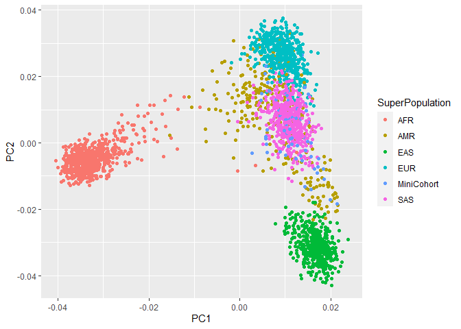
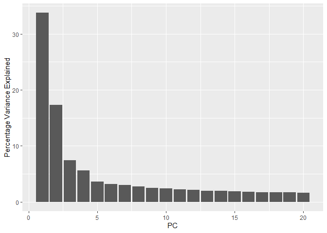
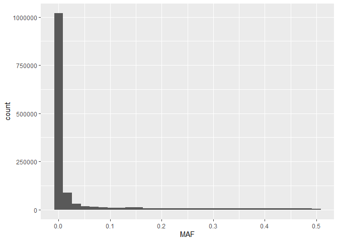
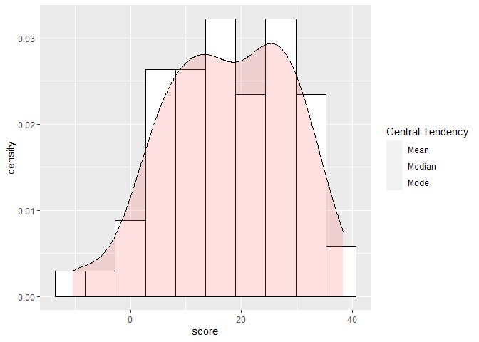
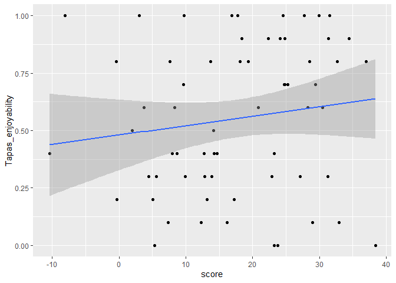

Assignment 7: PGS
================

-   [Assignment Overview](#assignment-overview)
-   [Getting Ready](#getting-ready)
-   [Genotyping Quality Control](#genotyping-quality-control)
    -   [General QC](#general-qc)
    -   [Global Ancestry Investigation](#global-ancestry-investigation)
    -   [a. PCA-specific QC](#a-pca-specific-qc)
    -   [b. PCA computation](#b-pca-computation)
    -   [c. Visualization](#c-visualization)
-   [Imputation](#imputation)
-   [Polygenic Scores (PGS)](#polygenic-scores-pgs)
    -   [PGS accuracy](#pgs-accuracy)

# Assignment Overview

In this assignment we will learn about population stratification,
imputation of genotypes, and using polygenic scores. Polygenic scores
(PGSs) can be useful for predicting disease susceptibility. In order to
calculate PGSs, we need two things: GWAS summary statistics (including
effect sizes), and genotypes. Most of the time, only a subset of a
person’s genotypes are actually measured (e.g. via SNP array), and so we
must impute the rest using a matched population of fully genotyped
individuals. This is the goal of Assignment 7.

Throughout the assignment we will be using a Mini Cohort that has
genetic data and some phenotypic variables, together with the 1000
Genomes Project samples. Both datasets are in bfile plink format, which
encompasses 3 files: *.bim, .bed and .fam* all the files can be located
under the following path: */usr/local/share/data/assignment\_7/*

# Getting Ready

In this assignment, we will be using the plink tool extensively. A plink
tutorial can be found here:
<https://zzz.bwh.harvard.edu/plink/tutorial.shtml>

``` bash
## Install plink1.9 onto your A1 conda environment:
#conda install -n BMEDG_1 -c bioconda plink

#ANSWER: First, we must set up server, log into our conda environment, and create a directory for this assignment. Then, we can install the tools in our environment.

ssh bkirsh@137.82.55.186
conda activate test_env
mkdir assignment7
cd assignment7
conda install -c bioconda plink
```

# Genotyping Quality Control

## General QC

Before we can start working on the genetic data, we need to ensure that
the quality is adequate. Thus, we are gonna check the following
measuring for our MiniCohort:

1.  **SNP call rate:** The call rate represents the percentage of
    participants with non-missing data for that SNP. Removing variants
    with a call rate lower than 95% avoids potential wrong calls to be
    included in further analysis

2.  **Minor Allele Frequency:** The minor allele frequency (MAF) echoes
    the less common allele frequency across the population. The MAF
    estimates tend to be more accurate for higher MAFs and the
    population sample size the MAF was based on. If there are too few
    samples representing the rare-allele, is hard to distinguish between
    a true rare-allele and sequencing errors.

3.  **Sample call rate:** Similar to SNP call rate, it allows to filter
    out all samples exceeding 98% missing genetic variants out of all
    the calls.

``` bash
## Using only one run of plink 1.9 (with different flags)
## 1. Filter out -SNPs- with more than 5% missingness
## 2. Filter out -variants- with less than 1% MAF
## 3. Filter out -samples- with more than 2% missingness
## 4. Create an output file in bfile format (which contains the bed, fam and bim files) for the MiniCohort QCed data

#?# Type the command you used below: - 3pt

plink --bfile /usr/local/share/data/assignment_7/Mini_cohort --geno 0.05 --mind 0.02 --maf 0.01 --make-bed --out MiniCohort_QCed
```

## Global Ancestry Investigation

In order to enhance imputation accuracy when dealing with ethnically
diverse cohorts is important to understand the genetic ancestries of the
cohort’s participants. Knowing the ancestral populations will ensure
that the most closely related population is used as a reference for the
imputation. For instance, one would not want to impute haplotypes of an
individual of Yoruban ancestry with a population of East Asians because
many of the haplotypes will differ between the two ancestries, leading
to imputing the wrong variants for the Yoruban person. Hence, we will
analyze the global ancestry of our cohort using Principal Component
Analysis (PCA). PCA is an unsupervised, unbiased way to reduce the
complexity of multidimensional.

## a. PCA-specific QC

We first need to ensure that only the most informative genetic variants
are used in the analysis. To do this, we will:

1.  **Filter out high linkage disequilibrium (LD) regions:** Because
    high LD regions will add redundancy to the PCA (leading to these
    regions dominating top PCs), they need to be removed.

2.  **LD pruning:** Similarly, LD causes redundancy even outside the
    particularly problematic high-LD regions. Thus, we will use
    LD-pruning to identify variants that are in LD, and select one per
    block.

``` bash
## Using only one run of plink 1.9 (with different flags)
## 1. Filter out the high-LD regions contained in the --high_LD_regions_hg19.txt-- file, located in /usr/local/share/data/assignment_7/
## 2. Use the --indep-pairwise to do LD prunning with the following parameters:
## - Window size: 200, 
## - Variant Count: 100 
## - VIF (variance inflation factor): 0.2 
#?# Type the command you use to create the Mini Cohort PCA-QCed bfile below: - 1pt

plink --bfile MiniCohort_QCed --extract range /usr/local/share/data/assignment_7/high_LD_regions_hg19.txt --indep-pairwise 200 100 0.2 --make-bed --out MiniCohort_PCA_QCed

## Use the output -.prune.in- file to extract only the informative variants and create a new bfile format (bed, fam and bim files) from:
## 1. The General MiniCohort QC bfile created before
## 2. The 1KGP_reference bfile located in /usr.local/share/data/assignment_7/

#?# Type the commands you used below: - 3pt

#ANSWER: First, we should inspect the file contents to find out what commands and flags to use. Using "head MiniCohort_PCA_QCed.prune.in," we uncover that it consists of a list of SNP IDs, so we can use Plink's "--extract" flag immediately followed by the files' names.

plink --bfile MiniCohort_QCed --extract MiniCohort_PCA_QCed.prune.in --make-bed --out MiniCohort_PCA_QCed_pruned
plink --bfile /usr/local/share/data/assignment_7/1KGP_reference --extract MiniCohort_PCA_QCed.prune.in --make-bed --out 1KGP_reference_pruned
```

## b. PCA computation

To assess the ethnic diversity in our cohort, we will use One-thousand
Genome Project (1KGP) data as a reference for our PCA analysis. These
dataset has genetic information of major continental populations:
Admixed American (AMR), European (EU), Asian (AS) and African (A).

``` bash
## Merge your pruned bfiles of the Mini_cohort and the 1KGP created on the previous step 
## Remember to create a new bfile (.fam, .bed and .bim files) that contains the merged data.
## IMPORTANT TIME CONSTRAINT: This step can take ~15 minutes, so make sure to check the server status before you run it!
#?# Type the command you used below: - 1pt

#ANSWER: First, I created file called "myFiles.txt," which contains 2 lines describing the files to be merged: 
#1KGP_reference_pruned.bed       1KGP_reference_pruned.bim       1KGP_reference_pruned.fam
#MiniCohort_PCA_QCed_pruned.bed  MiniCohort_PCA_QCed_pruned.bim  MiniCohort_PCA_QCed_pruned.fam
plink --merge-list myFiles.txt --make-bed --out myMergedOut

#ANSWER: Alternatively, we can simply use "--bmerge."
#plink --bfile MiniCohort_PCA_QCed_pruned --bmerge 1KGP_reference_pruned --make-bed --out merged

#?# Perform a PCA analysis in plink on the merged set - 1 pt

plink --bfile myMergedOut --pca
```

## c. Visualization

``` r
## Copy the PCA .eigenvec file to your computer, together with the samples_info.txt located in /usr/local/share/data/assignment_7/

#scp bkirsh@137.82.55.186:/home/bkirsh/assignment7/plink.eigenvec /mnt/c/Users/bkirs/Documents/School/BMEG400E/scp

#scp bkirsh@137.82.55.186:/usr/local/share/data/assignment_7/samples_info.txt /mnt/c/Users/bkirs/Documents/School/BMEG400E/scp

## Load the .eigenvec file onto R, change the column names to: FID, IID, PC1, PC2, PC3, ..., PC20
#?# Type the command you used below: - 1pt

myEigenvec <- read.table("~/School/BMEG400E/scp/plink.eigenvec",sep=" ",header=FALSE)
n <- 20
prefix <- "PC"
suffix <- seq(1:n)
myPCs <- paste(prefix,suffix,sep="") 
colnames(myEigenvec) <- c("FID", "IID", myPCs)

## Load the samples_info.txt file onto R, change the column names to: FID, IID, SuperPopulation, Population
#?# Tyoe the commands you used below: - 1pt

mySamples <- read.table("~/School/BMEG400E/scp/samples_info.txt",sep="\t",header=FALSE)
colnames(mySamples) <- c("IID", "FID", "SuperPopulation", "Population")

## Merge the .eigenvec and sample_info data.frames together using the IID column
## Tip: Look into the -merge- function!
#?# Type the command you used below: - 1pt

myMerged <- merge(myEigenvec, mySamples, by = "IID")

## Using ggplot create a scatterplot, using: 
## x-axis: PC1
## y-axis: PC2
## color: SuperPopulation - to use the Population information to color the samples and be able to appreciate population structure!
#?# Type the command you used below: 1pt

library(ggplot2)
p <- ggplot(myMerged, aes(x=PC1, y=PC2, color=SuperPopulation)) + geom_point()
p
```

<!-- -->

``` r
#?# Where do the cohort samples fall? Are they all clustered together? - 1 pt

#ANSWER: The cohort samples fall in a region of coincidence with samples from the AMR, SAS, and EUR populations, while the AFR and EAS populations appear to be distant and more graphically separated along the projected plane. With the aid of an interactive scatterplot, we can further isolate the MiniCohort trace and clearly visualize the arrangement of cohort samples. Their pattern of clustering is similar to that of the AMR population, where the dispersion of data points contrasts with the formation of tight aggregates  observed in the AFR, EAS, EUR, and SAS populations.
#library(plotly)
#ggplotly(p)

#?# Which Population would you use as a reference for imputation?, Why? - 1 pt

#ANSWER: I would use the AMR population because they colocalize and display a similar distribution pattern as the MiniCohort samples. When applied to population stratification, PCA can be used to reflect genetic variation that occurs due to ancestry in a sample. Thus, samples with similar values for a particular top principal component will have similar ancestry for that axes. Given that PC1 and PC2 capture population structure, similarities between AMR and MiniCohort suggest that the former can be used as a reference for imputation of the latter.

#?# Do you think looking at the top two PCs is sufficient to tell what population is best? Why/why not? - 2 pt

#ANSWER: This depends on the amount of variance that we wish to retain. Further inspection reveals that the remaining eigenvalues are considerably and consistently smaller, and that, together, PC1 and PC2 explain 50% of the variance. However, we should not rely entirely on the first two components to explain all stratification, since other components such as PC3 and possibly PC4 might be required to capture more variance. 

myEigenval <- scan("~/School/BMEG400E/scp/plink.eigenval")
pve <- data.frame(PC = 1:20, pve = myEigenval/sum(myEigenval)*100)
q <- ggplot(pve, aes(PC, pve)) + geom_bar(stat = "identity")
q + ylab("Percentage Variance Explained")
```

<!-- -->

``` r
cumsum(pve$pve)
```

    ##  [1]  33.77726  51.10680  58.55352  64.15504  67.73465  70.88939  73.89459
    ##  [8]  76.65982  79.14120  81.50620  83.70739  85.79387  87.77945  89.72747
    ## [15]  91.59528  93.34742  95.04666  96.71686  98.37346 100.00000

# Imputation

Imputation of genetic data is a very computationally intensive analysis,
that can take a long time. So we have performed it for you. Using the
chromosome 17 imputation information located in
*/usr/local/share/data/assignment\_7/* under the
*Mini\_cohort\_chr17\_imputation\_results.info.gz* we will calculate
some post-imputation metrics.

``` r
## Load the Mini_cohort_chr17_imputation_results.info.gz file to your Rstudio environment 

#scp bkirsh@137.82.55.186:/usr/local/share/data/assignment_7/Mini_cohort_chr17_imputation_results.info /mnt/c/Users/bkirs/Documents/School/BMEG400E/scp

myResults <- read.table("~/School/BMEG400E/scp/Mini_cohort_chr17_imputation_results.info",sep="\t",header=TRUE)

## Use the information in the file to answer the following questions. Accompany each of the answers with the code you used to get to them and a brief explanation of your thought process behind.
#?# What is the percentage of imputed SNPs? 0.5 pt

freq <- 100 * prop.table(table(myResults$Genotyped))
#ANSWER: The percentage of imputed SNPs is 99.3%. My thought process behind this was that the Genotyped column assigns a label of "Imputed" or "Genotyped" for each SNP, so a frequency table should inform us about their proportion.

## The metric of imputation quality is Rsq, this is the estimated value of the squared correlation between imputed and true genotypes. Since true genotypes are not available, this calculation is based on the idea that poorly imputed genotype counts will shrink towards their expectations based on allele frequencies observed in the population (https://genome.sph.umich.edu/wiki/Minimac3_Info_File#Rsq).  An Rsq < 0.3 is often used to flag poorly imputed SNPs. 
#?# What is the percentage of poorly imputed SNPs?

poorCount <- length(which(myResults$Rsq < 0.3))
poorFreq <- 100 * (poorCount / nrow(myResults) )
#ANSWER: The percentage of poorly imputed SNPs is 63.4%. My thought process behind this was that the Rsq column assigns an Rsq value to each SNP, so counting the number of entries below 0.3 and dividing it by the total number of entries should give us the percentage.

#?# Create a histogram to visualize the distribution of the MAF - 1 pt

r <- ggplot(myResults, aes(x=MAF)) + geom_histogram()
r
```

    ## `stat_bin()` using `bins = 30`. Pick better value with `binwidth`.

<!-- -->

``` r
#?# Which MAF is most frequent? What does that mean? - 1 pt

#ANSWER: The most frequent MAF is zero, meaning that the population is homozygous for most of the SNPs and usually carries two copies of the same major allele. 

#?# What is the maximum MAF? Why is that? - 1 pt

maxMAF <- max(myResults$MAF)

#ANSWER: The maximum MAF is 0.5. This metric ranges from 0 to 0.5 because it reports the frequency of the minor allele between two possible variations. With the exception of rare cases in which the locus is triallelic or quatrallelic, there are only a minor allele and a major allele for each SNP. Thus, when the frequency of either is greater than 0.5, it is regarded as the major allele and the MAF is calculated for its minor counterpart by subtracting it from 1. An an example, a locus that carries two alleles, A and B, at 0.7 and 0.3 frequency, respectively, will report a MAF of 0.3. This makes A the major allele and B the minor allele.
```

# Polygenic Scores (PGS)

A GWAS for affinity for tapas (the Spanish appetizer) was performed and
199 SNPs were found significantly associated. The significant SNPs and
their assigned effect sizes are described in the
*Tapas\_enjoyability\_GWAS\_sumStats.txt* file. Thanks to the imputation
performed in our MiniCohort, we were able to obtain the dosages (double
risk alleles=2, one risk allele=1, no risk alleles=0) for each one of
the SNPs associated to the Tapas ‘enjoyability’, described in the
*MiniCohort\_Tapas\_SNPdosages.txt*.

PGS are calculated by multiplying the effect sizes of each SNP by the
dosage of an individual for those SNP and then adding together all the
effectSize x dosage. The formula is outlined below, where:

-   i: individual of which you are calculating the PGS

-   j: SNP that has been found to be associated to the trait (Tapas
    enjoyability in this case)

-   Beta: Effect size

-   dosage: number of risk alleles the *individual i* has of the *risk
    allele j*? (2,1 or 0)


``` r
## Load to your RStudio:
## 1.  -Tapas_enjoyability_GWAS_sumStats.txt-
## 2.  -MiniCohort_Tapas_SNPdosages.txt- 
## Both are located in the A7 directory on github.

#scp bkirsh@137.82.55.186:/usr/local/share/data/assignment_7/Tapas_enjoyability_GWAS_sumStats.txt /mnt/c/Users/bkirs/Documents/School/BMEG400E/scp
#scp bkirsh@137.82.55.186:/usr/local/share/data/assignment_7/MiniCohort_Tapas_SNPdosages.txt /mnt/c/Users/bkirs/Documents/School/BMEG400E/scp

myEnjoyability <- read.table("~/School/BMEG400E/scp/Tapas_enjoyability_GWAS_sumStats.txt",sep="\t",header=TRUE)
myDosages <- read.table("~/School/BMEG400E/scp/MiniCohort_Tapas_SNPdosages.txt",sep="\t",header=TRUE)

## Using the base PRS formula outlined below, calculate the Tapas enjoyability PGS for the individuals in the Mini Cohort 
#?# Include your rationale and the documented code you used - 5pt

#RATIONALE: Since a PGS must be calculated for each individual in the Mini Cohort, we create a new data.frame containing two columns that store their IID and polygenic score. To compute the PGS themselves, we loop through the data.frame derived from the *Tapas_enjoyability_GWAS_sumStats.txt* file and, column-by-column, search for the corresponding SNP in the data.frame derived from the "MiniCohort_Tapas_SNPdosages.txt" file. Once a match is found, we multiply the effect size in the first data frame by the dosage in the second data frame, both corresponding to the same SNP. A vector containing the cumulative sum, or PGS, is incremented until all SNPs have been evaluated for a particular individual. Then, it is stored alongside the IID in the PGS data.frame, reinitialized, and calculated once again for the remainig individuals, until all individuals have been evaluated.

PGS.df <- data.frame(IID = character(), score = numeric(), stringsAsFactors = FALSE) #Here, we initialize a data.frame with empty vectors, which will be used to append data sets in a loop.
                                                          
for (a in 1:nrow(myDosages)){ #Here, we enter the first loop through the rows of the data.frame derived from the "MiniCohort_Tapas_SNPdosages.txt" file
  i <- myDosages[a,1] #We then retrieve the individual's IID, declare a vector to hold their PGS, and initialize it to zero
  sum <- 0
  for (b in 1:nrow(myEnjoyability)){ #Now, we enter the second loop through the rows of the data.frame derived from the *Tapas_enjoyability_GWAS_sumStats.txt* file
    j <- myEnjoyability[b,1] #Still for the same individual, we utilize the second data frame to retrieve the effect size of each SNP one-by-one. Then, with the corresponding dosage data in the first data frame, we compute their product. The polygenic risk score for this individual is then calculated summing over all SNPs 
    beta <- myEnjoyability[b,2]
    dosage <- myDosages[a,which(colnames(myDosages)==j)]
    sum <- sum + (beta * dosage) 
  }
  PGS.df[a,"IID"] <- i #Here, we add this individual's information (i.e., IID and PGS) to the PGS data.frame
  PGS.df[a,"score"] <- sum
}

#?# Use ggplot to plot the distribution of the Tapas PGS: - 2 pt
## Include the code and the graph in your analysis! 
## Tip: http://www.cookbook-r.com/Graphs/Plotting_distributions_(ggplot2)/

#Calculate min, max, range, and central tendency metrics:
library(modeest) 
```

    ## Warning: package 'modeest' was built under R version 4.0.4

``` r
minPGS <- min(PGS.df$score)
maxPGS <- max(PGS.df$score)
rangePGS <- maxPGS - minPGS
mean <- mean(PGS.df$score)
median <- median(PGS.df$score)
mode <- mlv(PGS.df$score)
```

    ## Warning: argument 'method' is missing. Data are supposed to be continuous. 
    ##             Default method 'shorth' is used

``` r
#Approximate the number of bins:
k <- 1 + 3.22 * log(nrow(PGS.df)) #Sturge's Rule (15)
k <- 2 * nrow(PGS.df) ** (1/3) #Rice's Rule (8)
k <- 3.49 * sd(PGS.df$score) * nrow(PGS.df) ** (-1/3) #Scott's Rule (10)
k <- 2 * IQR(PGS.df$score) * nrow(PGS.df) ** (-1/3) #Freedman-Diaconis’s Rule (9)

#Plot histogram with density plot and central tendency metrics:
s <- ggplot(PGS.df, aes(x=score)) + geom_histogram(aes(y=..density..), bins=10, colour="black", fill="white") + geom_density(alpha=.2, fill="#FF6666") + geom_vline(aes(xintercept=mean, color="Mean"), show.legend = TRUE, size=2)+geom_vline(aes(xintercept=median, color="Median"), show.legend = TRUE, linetype="dashed")+geom_vline(aes(xintercept=mode, color="Mode"), show.legend = TRUE, linetype="dashed") +scale_color_manual(name="Central Tendency", values = c(mean="red", median="blue", mode="green"))
s
```

<!-- -->

``` r
#?# What is the distribution of the tapas PGS? - 1pt
#ANSWE: The distribution is approximately normal. The curve is bell-shaped and symmetrical about the mean, median, and mode, all of which coincide in the plot.
```

## PGS accuracy

``` r
## The Tapas enjoyability was measured in a range of 0-1, with 0 being hating tapas and 1 being completely in love with tapas.
## This tapas likability is captured in the "Tapas_enjoyability" column of the -MiniCohort_Tapas_SNPdosages.txt- file. 
#?# Make a scatterplot with a linear regression line, where x is the Tapas-PGS and y is their actual Tapas enjoyability - 2 pt
## Tip: http://www.sthda.com/english/wiki/ggplot2-scatter-plots-quick-start-guide-r-software-and-data-visualization

PGS_actual.df <- merge(PGS.df,myDosages[, c("IID","Tapas_enjoyability")],by="IID")
u <- ggplot(PGS_actual.df, aes(x=score, y=Tapas_enjoyability)) + geom_point()+geom_smooth(method=lm)
u
```

    ## `geom_smooth()` using formula 'y ~ x'

<!-- -->

``` r
#?# What is the correlation coeficient between the PGS and Tapas enjoyability? Is Spearman or Pearson correlation more appropriate here? Why? - 3 pt

c <- cor(PGS_actual.df$score,PGS_actual.df$Tapas_enjoyability)

#ANSWER: The correlation coefficient is 0.14, meaning that the association is either very weakly positive or non-existent. In this case, the Pearson correlation is more appropriate because the data is continuous and normally distributed.

#?# How predictive is the PGS for tapas preference? Include in your answer why do you think it is/isn't accurate and what could affect its predicitvity - 2pt 

#ANSWER: The PGS does not accurately predict tapas preference. For one, enjoyability is subjective and socially constructed, which means that this variable is heavily influenced by cultural and environmental factors. Furthermore, accurate assessment requires us to address the ascertainment bias caused by over-representation of European populations in genotyping arrays and GWAS samples. Thus, another major factor that could affect predictivity is that risk can be grossly misestimated in our ethnically diverse MiniCohort simply because certain populations are not as familiar with the Spanish appetizer. 
```
